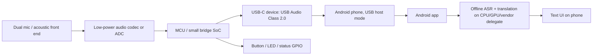

# Hardware Feasibility: Android-Connected USB-C Translator Dongle

## Table of Contents
- [Executive Summary](#executive-summary)
- [Research Methodology](#research-methodology)
- [Key Findings](#key-findings)
- [Recommended v1 Architecture](#recommended-v1-architecture)
- [Platform Comparison](#platform-comparison)
- [Risks and Mitigations](#risks-and-mitigations)
- [Sources](#sources)
- [Unresolved Questions](#unresolved-questions)

## Executive Summary

A compact USB-C dongle attached to an Android phone is feasible if it is treated as a standard USB peripheral, not as a compute endpoint. The clean v1 design is a USB Audio Class device with dual microphones, local button/LED, and a minimal bridge MCU or codec front end. The phone stays the compute engine: the Android app captures USB audio, runs ASR/translation locally, and renders text on-screen. That is aligned with Android's USB host model, which makes the phone the host and the peripheral the device.

The main constraint is software, not raw feasibility: Android device support varies, microphone capture is permission- and foreground-service-gated, and offline translation performance depends on the phone's CPU/GPU/vendor accelerator stack. Android's current guidance favors LiteRT/TensorFlow Lite-style runtimes with GPU or vendor delegates; NNAPI exists but is deprecated in Android 15. A dongle should not claim access to the phone NPU over USB. The dongle can only present audio and control interfaces; all inference runs inside the Android app on available on-device compute paths.

For v1, the best fit is a phone-assisted companion dongle, not an autonomous edge device. It gives the smallest BOM, lowest thermal risk, best privacy story, and fastest path to a credible prototype. An autonomous translator device is technically cleaner in isolation but materially worse on size, power, cost, and product complexity.

## Research Methodology

- Sources consulted: official Android docs, source.android docs, USB-IF docs, Qualcomm developer docs, ST and TI product docs.
- Date range of materials: mostly 2024-2026 docs, plus a few evergreen USB class/device-class references.
- Key search terms used: Android USB host accessory audio, USB audio class Android, USB Type-C power delivery, Android foreground service microphone, LiteRT GPU delegate, NNAPI deprecated, Qualcomm AI Engine, USB HID, low-power audio codec, STUSB4500.

Source credibility ranking used:
- Highest: Android Developers, source.android.com, USB-IF.
- High but vendor-specific: Qualcomm, STMicroelectronics, Texas Instruments.
- Low confidence by default: forums/blogs. I avoided relying on them for core claims.

## Key Findings

### 1. USB roles and protocol choice

Android supports two USB roles that matter here: host and accessory. In host mode, the phone enumerates peripherals and powers the bus; in accessory mode, the accessory acts as host and powers the bus. For a dongle attached to a phone, host mode is the natural fit.

Official Android guidance for audio over USB says host mode enables Android to operate with a wide range of USB peripherals, including audio interfaces. Android also documents that AOA accessory-mode audio is limited and deprecated for modern use. That makes standard USB Audio Class the safer protocol choice for a v1 dongle.

Best protocol split for v1:
- USB Audio Class 2.0 for mic capture into the phone.
- HID for a push-to-talk or mode button if needed.
- No proprietary transport if interoperability matters.

Why not accessory mode:
- It is the wrong power direction for a phone-attached dongle.
- Android's accessory audio path is limited and legacy.
- It reduces compatibility for no gain in this use case.

### 2. Android audio and app constraints

Android can capture audio from an external mic or audio interface. For voice-like capture, `VOICE_RECOGNITION` or `VOICE_COMMUNICATION` audio sources are the right starting points. For always-on or near-real-time capture, the app should be designed as a foreground service and request microphone permission explicitly; Android 14+ makes foreground-service typing and microphone permission handling stricter.

Practical implication:
- The dongle should present itself as a normal USB microphone or audio interface.
- The app should read it through Android's audio stack, not through a custom kernel driver.
- The app must handle foreground-service and permission policy correctly, or capture will be interrupted or silenced on modern Android.

### 3. Compute model

The phone is the compute engine. The dongle cannot and should not expose a "phone NPU access" path. Translation inference runs inside the Android app using:
- CPU
- GPU delegates
- vendor AI runtimes / delegates where supported
- NNAPI only as legacy compatibility, not as the core bet

Google's current LiteRT docs describe GPU delegates and vendor NPU delegates as the acceleration path. Android's NNAPI docs now mark NNAPI as deprecated. Qualcomm's AI docs likewise frame the AI Engine / Hexagon path as on-device hardware acceleration inside Snapdragon platforms, not as a USB-accessed peripheral resource.

### 4. Power and thermal envelope

USB-C and USB Power Delivery can deliver much more power than this product needs, but that is not the same as saying a phone should source that much to a dongle. Android host mode means the phone powers the bus, so the dongle should be designed to work with a very small power envelope unless it is self-powered.

Engineering estimate for v1 bus-powered design:
- Idle control logic: low single-digit mW to a few tens of mW
- Dual-mic + codec + MCU active path: roughly 50-200 mW class
- Add local DSP/AEC/beamforming: plan for 200-500 mW class

If you add heavier on-dongle DSP, do not assume phone power is enough. Make the dongle self-powered or keep DSP minimal. For a first prototype, keep the dongle passive-ish: capture, precondition, and forward.

### 5. Compatibility risk

The biggest risk is not USB itself. It is Android fragmentation:
- Some phones have better USB audio routing behavior than others.
- Foreground-service and permission behavior changes across Android releases.
- On-device inference acceleration varies strongly by SoC vendor and device model.
- Some phones are better at sustained ML than they are at peak benchmark numbers.

This is why the v1 product should explicitly define a supported phone matrix rather than claiming universal Android support.

### 6. Security and privacy

The privacy story is good if the design stays local:
- Audio stays on-device.
- Translation stays on-device.
- The dongle exposes only audio/control interfaces.
- No cloud dependency is required at runtime.

Security risks are mostly standard mobile-app risks:
- microphone permission abuse
- foreground-service misuse
- untrusted USB device enumeration if the dongle firmware is compromised
- update integrity for any firmware on the dongle

Mitigation is straightforward:
- code-sign firmware updates
- keep the dongle protocol standard
- request minimum Android permissions
- display clear recording state in UI and LED

## Recommended v1 Architecture

Recommended v1 hardware scope:
- USB-C peripheral, not host
- USB Audio Class 2.0 microphone path
- HID button optional
- LED for capture/status
- No on-dongle LLM, no on-dongle NPU claim

Recommended phone requirements:
- Android 14+ target for policy alignment; Android 13+ acceptable minimum for initial field testing
- USB host mode enabled
- USB Audio Class peripheral support
- Mic permission granted
- Foreground service for live capture
- At least 6 GB RAM; 8 GB preferred
- Modern SoC with usable GPU or vendor ML delegate support
- Enough thermal headroom for sustained on-device inference

## Indicative BOM

Prototype BOM, by class, not exact part-lock:

| Block | Suggested class | Why it fits |
|---|---|---|
| USB-C interface | USB-C receptacle + ESD protection | Mandatory physical interface and signal protection |
| USB role/power detect | Type-C sink / attach detect controller, or MCU with suitable Type-C support | Reliable attach/orientation/power detection |
| Audio front end | Low-power stereo codec with digital mic support | Clean voice capture and mic bias support |
| Controller | Low-power MCU with USB device + I2S/SAI + enough RAM | Bridges audio to USB and handles UI logic |
| Mic pair | 2x digital MEMS mics or 1 stereo front end | Better SNR and beamforming options |
| UI | 1 button, 1 status LED | PTT and obvious capture state |
| Memory | Small external flash if firmware/model configs grow | Firmware/config storage |
| Enclosure | Small rugged shell | Productization and strain relief |

Vendor examples that fit the class:
- STUSB4500 class for simple sink/PD control when needed; ST documents it as a sink controller up to 100 W, though v1 likely does not need that much power headroom.
- STM32U5 family class for low-power MCU/USB work.
- TI TLV320AIC3263 or similar low-power codec class for voice capture.

I would not lock exact SKUs until the electrical budget and USB routing are frozen.

## Platform Comparison

### 1. Phone-only

Pros:
- Lowest BOM.
- Lowest compatibility surface.
- No dongle certification burden.

Cons:
- Worst audio ergonomics.
- No dedicated mic geometry or physical controls.
- Harder to differentiate.

Fit:
- Good as a baseline app.
- Weak as the final product if the product promise is the dongle.

### 2. USB audio/mic companion dongle

Pros:
- Best balance of feasibility and differentiation.
- Preserves phone compute, battery, app UI, and offline model agility.
- Standard USB Audio Class is broadly compatible.
- Can add a physical button and obvious recording LED.

Cons:
- Phone compatibility still needs testing.
- USB audio routing differences exist across devices.
- Power budget is limited unless self-powered.

Fit:
- Best v1 choice.

### 3. Autonomous edge device

Pros:
- Full control of hardware and thermal envelope.
- No dependency on phone USB/audio quirks.
- Easier to guarantee a fixed experience.

Cons:
- Highest BOM and enclosure complexity.
- Harder battery/thermal story.
- Needs its own UI or still needs a companion app.
- More firmware, OTA, certification, and support burden.

Fit:
- Best only if the product becomes a standalone translator, not a dongle.

## Risks and Mitigations

| Risk | Impact | Mitigation |
|---|---|---|
| USB audio routing differs by phone | Device may not capture as expected | Maintain a supported-device matrix; test on Pixel, Samsung, and one midrange Qualcomm device |
| Live capture blocked by Android policy | Translation stops in background | Use correct foreground-service type and permissions |
| Sustained on-device inference overheats phone | Latency spikes, battery drain | Use quantized models, chunked streaming, and adaptive model sizing |
| Dongle draws too much current | Brownouts or disconnects | Keep dongle low power; avoid on-dongle heavy DSP unless self-powered |
| Firmware compromise | Malicious audio/control behavior | Signed firmware, minimal protocol surface, no cloud dependency |
| Overclaiming NPU access | Product credibility risk | State compute as app runtime only; mention CPU/GPU/vendor delegates explicitly |

## Recommendation

Ranked choice for this project:

1. USB audio/mic companion dongle with Android app compute. This is the best architectural fit for the stated product.
2. Phone-only app. Use this only as the lowest-risk baseline or fallback if hardware slips.
3. Autonomous edge device. Strong technically, but misaligned with the compact-dongle goal and too expensive for v1.

My firm recommendation: build the USB Audio Class companion dongle, keep the hardware simple, and push the intelligence into the Android app using CPU/GPU/vendor delegate paths. Do not add any claim of direct phone-NPU access.

## Sources

Android / source.android:
- [USB host and accessory overview](https://developer.android.com/develop/connectivity/usb)
- [USB accessory overview](https://developer.android.com/develop/connectivity/usb/accessory)
- [Build audio accessories](https://source.android.com/docs/core/interaction/accessories/audio)
- [USB digital audio](https://source.android.com/docs/core/audio/usb)
- [USB headset accessory specification](https://source.android.com/docs/core/interaction/accessories/headset/usb-headset-spec)
- [Sharing audio input](https://developer.android.com/media/platform/sharing-audio-input)
- [MediaRecorder.AudioSource reference](https://developer.android.com/reference/android/media/MediaRecorder.AudioSource)
- [Foreground service types required](https://developer.android.com/about/versions/14/changes/fgs-types-required)
- [LiteRT GPU delegate for Android](https://ai.google.dev/edge/litert/android/gpu)
- [LiteRT NPU delegate overview](https://ai.google.dev/edge/litert/android/npu/overview)
- [NNAPI NDK guide](https://developer.android.com/ndk/guides/neuralnetworks)

USB-IF:
- [USB Charger (USB Power Delivery)](https://www.usb.org/usb-charger-pd)
- [USB Type-C cable and connector specification page](https://www.usb.org/usb-type-cr-cable-and-connector-specification)
- [USB device class definition for audio devices](https://www.usb.org/document-library/usb-device-class-definition-audio-devices-release-20-errata-and-ecn-through-april)
- [Defined class codes](https://www.usb.org/defined-class-codes)
- [Device Class Definition for HID 1.11](https://www.usb.org/document-library/device-class-definition-hid-111)

Vendor / implementation references:
- [Qualcomm AI Engine Direct SDK](https://www.qualcomm.com/developer/software/qualcomm-ai-engine-direct-sdk)
- [Qualcomm AI Engine / mobile AI overview](https://www.qualcomm.com/smartphones/features/mobile-ai)
- [Qualcomm Hexagon NPU / AI Engine overview](https://www.qualcomm.com/processors/hexagon)
- [STUSB4500 product page](https://www.st.com/en/interfaces-and-transceivers/stusb4500.html)
- [STM32U5 series](https://www.st.com/en/microcontrollers-microprocessors/stm32u5-series.html)
- [TI TLV320AIC3263 datasheet](https://www.ti.com/lit/gpn/TLV320AIC3263)

## Unresolved Questions

- Exact supported-phone matrix is still unknown.
- Exact BOM cost depends on volume, enclosure, and whether the dongle needs self-powered operation.
- Exact on-device model family is still a separate AI-design decision, not a hardware decision.
- Whether the final product needs wake-word always-on capture or push-to-talk only is still open.
