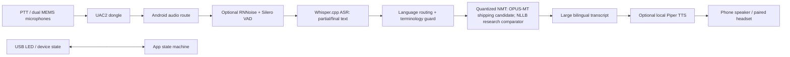

# Nghiên cứu kỹ thuật và thị trường: VoiceKey

**Ngày nghiên cứu:** 21/08/2026 (ICT; cập nhật vòng phản biện bằng chứng, chi phí và triển khai)
**Mục tiêu:** đề xuất một phụ kiện USB-C cho điện thoại Android để dịch hội thoại EN <-> VI offline, hiển thị text trên màn hình điện thoại và có thể mở rộng một số ngôn ngữ Đông Nam Á.
**Kết luận trước:** làm được, nhưng sản phẩm đáng tin cậy nhất là **USB Audio Class companion + Android app xử lý AI**, không phải một "USB NPU" cố truy cập trực tiếp vào NPU của điện thoại.

## Mục lục

1. [Cách hiểu mẫu và yêu cầu thật](#1-cách-hiểu-mẫu-và-yêu-cầu-thật)
2. [Phạm vi và nguyên tắc chứng cứ](#2-phạm-vi-và-nguyên-tắc-chứng-cứ)
3. [Tóm tắt quyết định](#3-tóm-tắt-quyết-định)
4. [Thị trường, đối thủ và demo mạng xã hội](#4-thị-trường-đối-thủ-và-demo-mạng-xã-hội)
5. [Tổng quan khoa học và lựa chọn model](#5-tổng-quan-khoa-học-và-lựa-chọn-model)
6. [Khả thi Android và USB-C](#6-khả-thi-android-và-usb-c)
7. [Kiến trúc sản phẩm đề xuất](#7-kiến-trúc-sản-phẩm-đề-xuất)
8. [Kế hoạch đánh giá và tiêu chí nghiệm thu](#8-kế-hoạch-đánh-giá-và-tiêu-chí-nghiệm-thu)
9. [Rủi ro, giới hạn và roadmap](#9-rủi-ro-giới-hạn-và-roadmap)
10. [Vòng phản biện thứ hai: paper, video, giá, chi phí và lợi ích](#10-vòng-phản-biện-thứ-hai-paper-video-giá-chi-phí-và-lợi-ích)
11. [Danh mục nguồn](#11-danh-mục-nguồn)

## 1. Cách hiểu mẫu và yêu cầu thật

File PDF được cung cấp là **mẫu Technical Proposal của OneVoice AI Challenge**, không phải đặc tả kỹ thuật đã được chứng minh. Vì vậy, tôi dùng nó theo ba cách:

- Giữ các phần và rubric: Problem & Impact 15%, Business Solution 15%, AI & Technical Design 35%, Hardware 25%, Team/Execution 10%.
- Dùng các bảng và ví dụ trong template như **gợi ý trình bày**, không sao chép model, số liệu latency, SoC hay claim minh họa trong đó thành sự thật.
- Không tuân theo chỉ dẫn "export PDF" như một yêu cầu thay thế yêu cầu của chủ dự án: deliverable được tạo ở task này là Markdown và DOCX. PDF chỉ được dùng để đọc bố cục/rubric.

Yêu cầu sản phẩm được hiểu là:

- phụ kiện nhỏ cắm USB-C Type-C vào điện thoại;
- ưu tiên EN <-> VI, offline khi đã cài language pack;
- dùng tài nguyên xử lý của điện thoại, text song ngữ hiển thị trên màn hình app;
- STT và TTS là các module có thể bật/tắt;
- mở rộng dần sang một số ngôn ngữ Đông Nam Á;
- phải có proposal có cơ sở, không chỉ marketing.

Một điểm cần chỉnh về mặt kỹ thuật: model không nên được đọc/chạy trực tiếp từ USB dongle trong bản v1. Model weights phải được cài, kiểm tra chữ ký và nạp từ private storage/RAM của app Android. Dongle có thể mang firmware, cấu hình hoặc một cache cài đặt có ký, nhưng **không** nên là nơi chạy inference hay là lời hứa "mở NPU điện thoại qua USB".

## 2. Phạm vi và nguyên tắc chứng cứ

### 2.1 Phạm vi

Nghiên cứu này xem xét cả conversational speech-to-text translation và speech-to-speech translation. Bản đề xuất không hứa simultaneous translation liên tục ngay từ ngày đầu. Mục tiêu khả thi là **turn-based, low-latency translation**: người nói nhấn/giữ nút, nói một lượt ngắn, app hiển thị partial/final text, dịch và tùy chọn đọc TTS.

### 2.2 Phân tầng nguồn

| Mức | Dùng cho | Ví dụ |
|---|---|---|
| A - nguồn sơ cấp | Quyết định kỹ thuật và claim thực tế | Android Developers, USB-IF, paper ACL/arXiv, model card/repo chính thức |
| B - nguồn độc lập | Kiểm tra UX hoặc giới hạn thị trường | WIRED/WSJ review, manual công khai |
| C - social/retail | Tìm demo, luồng thao tác, tín hiệu nhu cầu | Douyin, Facebook, TikTok Shop |

Mức C **không** được dùng để chứng minh accuracy, latency hoặc offline coverage. Các claim trong clip/listing được ghi là claim của nhà bán hoặc creator.

### 2.3 Điều không được hứa

- Không nói "mọi điện thoại Android"; cần support matrix thực nghiệm.
- Không nói "mô hình chạy trong USB" nếu dongle chỉ là audio accessory.
- Không nói "NPU accessible from USB". App Android có thể sử dụng CPU/GPU/vendor delegate mà hệ điều hành/runtime expose, nhưng quyền và hiệu năng khác nhau theo máy.
- Không gọi mọi ngôn ngữ là offline. Mỗi language pair, ASR voice, TTS voice phải có language-pack status riêng.
- Không lấy con số 95% accuracy hoặc sub-second từ marketing cạnh tranh làm KPI của sản phẩm.

## 3. Tóm tắt quyết định

### Khuyến nghị sản phẩm

**VoiceKey** là microphone/interaction companion có dây USB-C cho Android. Nó có 2 MEMS mic, audio front end nhỏ, LED trạng thái và nút Push-to-Talk. App Android là nơi nhận USB audio, làm VAD -> ASR -> MT -> UI -> optional TTS hoàn toàn offline sau khi cài pack.

| Hạng mục | Quyết định v1 | Lý do |
|---|---|---|
| Form factor | Dongle 45 x 22 x 9 mm, <20 g, USB-C male trên đoạn pigtail mềm ngắn | Tránh lực bẻ lên cổng điện thoại; giữ lợi thế nhỏ gọn |
| USB | USB Audio Class 2.0, HID/control tối thiểu | Chuẩn class-compliant, giảm driver/protocol riêng |
| Compute | Android app: native C++/JNI + runtime được kiểm thử | Đúng mô hình host của Android; dùng CPU/GPU/vendor delegate khi có |
| Inference | Cascaded VAD -> ASR -> MT -> TTS | Có thể thay từng module, phù hợp EN-VI hơn direct S2ST on-device |
| Launch language | EN <-> VI voice/text; English và Vietnamese TTS | Tập trung benchmark và UX thật trước |
| Phase 2 | Indonesian, Thai, Malay, Tagalog; text-only fallback nếu TTS chưa đạt | Có coverage multilingual tốt hơn; không overclaim |
| Connectivity | Không API khi runtime; pack phải tải/cài trước | Định nghĩa offline rõ và kiểm chứng được |
| Interaction | PTT/half-duplex trước; continuous mode sau AEC/thermal test | Tránh echo từ phone speaker và crosstalk khi ra v1 |

### Tại sao đây là lựa chọn tốt hơn hai cực còn lại

Phone-only app rẻ nhất nhưng không tạo khác biệt hardware, micro và thao tác yếu. Translator handheld tự chủ có màn hình/battery/SoC riêng nhưng dày, đắt, nóng và lặp lại phần cứng điện thoại. USB-C audio companion dùng chính màn hình, pin và compute của điện thoại nhưng cải thiện capture, physical control và privacy. Đây là khoảng trống nằm giữa earbuds Bluetooth và handheld translator.

## 4. Thị trường, đối thủ và demo mạng xã hội

### 4.1 Pattern thị trường

Thị trường hiện chia thành hai nhóm:

1. **Earbuds + app** - tự nhiên/hands-free hơn, nhưng Bluetooth pairing, app dependency và text cho người đối thoại thường không phải trọng tâm.
2. **Handheld translator** - có màn hình/camera và cách dùng rõ, nhưng phải mang thêm pin, modem, màn hình và compute riêng.

Ví dụ, [Timekettle New T1](https://www.timekettle.co/pages/t1) là handheld và tự công bố offline packs, màn hình, SIM/online capability. [Timekettle W4 Pro](https://www.timekettle.co/products/w4-pro-ai-interpreter-earbuds-2026) nhấn app-connected subtitles/calls. [Vasco E1](https://vasco-translator.com/translators/vasco-translator-e1) là earbud phụ thuộc phone hoặc Vasco device; [Vasco V4](https://vasco-translator.com/translators/vasco-translator-v4) là handheld có 5-inch screen và SIM. [Pocketalk S2 manual](https://manual.pocketalk.com/pts2/en/) cho thấy một luồng handheld quen thuộc: Wi-Fi/mobile network, Bluetooth pairing, history, camera và chỉnh cỡ text.

### 4.2 So sánh sản phẩm liên quan

| Offering | Kiểu | Liên kết điện thoại | Offline được xác nhận | Text cho người dùng | Bài học cho VoiceKey |
|---|---|---|---|---|---|
| [Timekettle M2](https://www.timekettle.co/products/m2-language-translator) | Earbuds | Bluetooth/app | Trang chính thức nói online/offline speech; phạm vi pair cần xác nhận trước khi so sánh | Không có display trên earbuds | Hands-free không thay thế được transcript lớn |
| [Timekettle W4 Pro](https://www.timekettle.co/products/w4-pro-ai-interpreter-earbuds-2026) | Earbuds | Phone/app | Không dùng làm benchmark offline nếu không có manual scoped-by-mode | App hiển thị transcript | Phone UI là giá trị; USB-C có thể giảm pairing friction |
| [Vasco E1](https://vasco-translator.com/translators/vasco-translator-e1) | Earbuds | Phone hoặc Vasco device | Không xác nhận offline ở trang đã xem | Không có display độc lập | Không nên bán như earbuds/music/call device |
| [Timekettle T1](https://www.timekettle.co/pages/t1) | Handheld | Độc lập | Company claims 31+ offline packs | 4-inch display | Màn hình là quan trọng, nhưng có thể dùng screen phone thay vì thêm handheld |
| [Vasco V4](https://vasco-translator.com/translators/vasco-translator-v4) | Handheld | Độc lập + SIM | Trang nhấn mạng lifetime; không coi là offline proof | 5-inch screen | Cloud/SIM là chi phí và privacy trade-off |
| [Pocketalk S2](https://manual.pocketalk.com/pts2/en/) | Handheld | Độc lập | Không thấy offline speech proof trong manual xem xét | Có text size, history, camera | UX screen-first tốt nhưng hardware scope rộng |
| [WEAST S680 Pro](https://www.kickstarter.com/projects/1076283477/weast-s680-pro-magnetic-clip-on-translator-earbuds/description) | Crowdfunding earbuds | Bluetooth | Chưa xác thực | Không | Demand signal, không phải evidence sản phẩm đã chứng minh |

### 4.3 Demo social và cách dùng đúng

| Nền tảng/demo | Điều có thể quan sát | Độ tin cậy | Ý nghĩa |
|---|---|---|---|
| [Douyin: Timekettle X1 offline demo](https://www.douyin.com/shipin/7339037962950166591) | Video/do transcript mô tả claim về lựa chọn offline và yêu cầu download pack trước; hãng/creator cũng nêu latency/accuracy | C - marketing/demo | Tham chiếu cho luồng *được claim* “pre-download rồi flight mode”; phải tự kiểm chứng, không phải benchmark hay offline proof |
| [Douyin: Timekettle M3 tutorial](https://www.douyin.com/shipin/7281915783440009273) | Official store tutorial thể hiện caption text, Bluetooth/app workflow và thao tác hội thoại | C - official social | Cơ hội cho USB-C là giảm pairing và làm text UI tốt hơn |
| [Facebook: Timekettle 30-second demo](https://www.facebook.com/TimekettleTech/posts/we-know-the-world-30-seconds-demo-about-a-piece-of-english-news-translated-to-ch/1841012286079530/) | Post của hãng giới thiệu demo English -> Chinese | C - official marketing | Chỉ làm reference demo format |
| [Facebook: Vasco E1 video](https://www.facebook.com/VascoTranslator/videos/vasco-translator-e1-you-wear-it-you-speak-you-understand/1262717628318906/) | Video quảng bá wearable conversation flow | C - official marketing | Củng cố nhu cầu hands-free nhưng không chứng minh latency/quality |
| [TikTok Shop: W4 Pro listing](https://shop.tiktok.com/us/pdp/timekettle-w4-pro-ai-translation-earbuds-133-languages-wireless-headphones/1729671968857166344) | Retail page nêu offline pairs, 3-mic và call use; page hiển thị phần AI-generated retail text | C - retail | Dùng để xem language-pack messaging/pitfall, không dùng như demo hay source kỹ thuật |
| [WSJ Pocketalk video review](https://www.youtube.com/watch?v=BlIbgYxWIfs) | Independent creator/reviewer demo street-use | B - independent demo | Nên học cách test trong ngữ cảnh thật, không chỉ bàn lab |

TikTok không cho crawler truy cập clip trực tiếp trong lượt nghiên cứu này. Vì vậy TikTok Shop được nêu rõ là nguồn retail, không bị gán thành video proof. Douyin/Facebook cũng phải được đọc như marketing cho đến khi có test nội bộ.

### 4.4 Khoảng trống cạnh tranh và positioning

**Không cạnh tranh bằng "150 ngôn ngữ".** Một claim quá rộng nhưng không công khai quality theo từng pair sẽ yếu hơn một EN-VI offline có benchmark, glossary, transcript và hardware interaction rõ ràng.

Vị thế tốt nhất:

> "A wired, offline-first Android translation companion for short face-to-face conversations: clearer capture, large bilingual text, and no runtime cloud dependency."

Năm anti-features phải tránh:

1. Claim universal/offline mọi pair.
2. Gọi cloud fallback là offline.
3. Bỏ text transcript trên điện thoại.
4. Mở rộng sớm sang music, phone calls, video streaming, group meeting.
5. Công bố latency/accuracy không có handset + test-set + percentile.

## 5. Tổng quan khoa học và lựa chọn model

### 5.1 Kết luận khoa học: cascade là đường shipping đúng

[Whisper](https://arxiv.org/abs/2212.04356) cho ASR multilingual có evidence mạnh; [whisper.cpp](https://github.com/ggml-org/whisper.cpp) có Android-capable C/C++ execution và quantized inference. [NLLB-200](https://arxiv.org/abs/2207.04672) hữu ích để nghiên cứu coverage 200-language cho SEA, nhưng model card distilled 600M là CC-BY-NC, research-only và nói rõ không phát hành cho production; vì vậy không thể là pack shipping nếu chưa có quyền thương mại rõ ràng ([model card](https://huggingface.co/facebook/nllb-200-distilled-600M)). Với v1 thương mại, [OPUS-MT EN-VI](https://huggingface.co/Helsinki-NLP/opus-mt-en-vi) / [VI-EN](https://huggingface.co/Helsinki-NLP/opus-mt-vi-en) là candidate pair-specific thực tế hơn, vẫn cần ledger cho weights, tokenizer, runtime và provenance trước khi release. Piper/Sherpa-ONNX cung cấp đường offline TTS/Android thực tế hơn việc tự huấn luyện voice ngay từ đầu: xem [Piper voices](https://github.com/rhasspy/piper/blob/master/VOICES.md) và [Sherpa-ONNX](https://github.com/k2-fsa/sherpa-onnx).

Direct speech-to-speech như [SeamlessM4T](https://arxiv.org/abs/2308.11596) và [SeamlessStreaming](https://arxiv.org/abs/2312.05187) rất quan trọng về research, nhưng không phải MVP EN-VI trên phone. Tài liệu on-device của project nêu export nhỏ thử nghiệm chỉ hỗ trợ `eng`, `fra`, `hin`, `por`, `spa`, không có Vietnamese ([on-device README](https://github.com/facebookresearch/seamless_communication/blob/main/docs/m4t/on_device_README.md)). Các checkpoint Medium/Large cũng quá nặng để hứa thermal/battery tốt ở product v1.

### 5.2 Module đề xuất

| Module | Lựa chọn v1 | Vì sao | Alternative/fallback | Điều phải benchmark |
|---|---|---|---|---|
| Audio input | UAC2, dual MEMS mic | Có dây, độ trễ/pairing xác định hơn Bluetooth | Phone mic khi dongle rút | SNR, clipping, device routing |
| VAD | [Silero VAD](https://github.com/snakers4/silero-vad) | Nhẹ, phù hợp endpointing; repo công bố model nhỏ/real-time | WebRTC VAD | False endpoint, speech/noise miss |
| Denoise | [RNNoise](https://github.com/xiph/rnnoise) chỉ bật ở noise profile xấu | Hybrid DSP/neural, không cần nói quá mức | Bypass cho phòng yên | WER gain vs added latency |
| ASR | Whisper `base`/`small` qua whisper.cpp; PhoWhisper chỉ là alternate có compatibility gate | Multilingual + Android path tốt nhất trong source set | Moonshine chỉ là research branch | WER/CER, RTF, thermal, reproducible conversion/runtime |
| MT | [OPUS-MT en-vi](https://huggingface.co/Helsinki-NLP/opus-mt-en-vi) / [vi-en](https://huggingface.co/Helsinki-NLP/opus-mt-vi-en) pair-specific shipping candidate | EN-VI pair nhỏ hơn; cards Apache-2.0 nhưng vẫn cần release ledger | NLLB-200 chỉ benchmark non-commercial nếu cần coverage research | COMET, BLEU, terminology, RAM, licence/provenance |
| TTS | Piper voice qua Sherpa-ONNX | Local, modular, có Vietnamese catalog | Phone TTS only nếu license/voice không đạt | intelligibility, names/numbers |
| UI | Bilingual transcript trên phone | Partner nhìn thấy source/target, sửa được misunderstanding | TTS off/text-only | task success, reading distance |

### 5.3 Kích thước và memory: dùng range, không làm giả số chính xác

Model package thực tế thay đổi theo quantization, vocabulary, tokenizer, voice và build flags. Proposal phải dùng **engineering range để budget**, sau đó thay bằng số đo release artifact:

| Asset | Planning range | Chính sách |
|---|---:|---|
| VAD + denoise | vài MB đến vài chục MB | Resident trong app, không đáng kể so với ASR/MT |
| Whisper quantized ASR | khoảng 100 MB đến 600 MB | Chọn base/small sau benchmark không phải theo tên model |
| Pair-specific MT quantized | khoảng 80 MB đến 300 MB | Shipping candidate EN-VI sau quality/licence/runtime gate |
| NLLB multilingual pack quantized | khoảng 0.6 GB đến hơn 1 GB | Non-commercial research comparator; không đưa vào product release khi chưa có commercial rights |
| TTS voice + phonemizer | khoảng 20 MB đến 150 MB/mỗi voice | Cài lazy và theo language |
| Runtime buffers/RAM | 0.6 GB đến 1.8 GB tùy pack | Không nạp simultaneous tất cả language/model |

Tối ưu hóa cần có:

- quantize INT8/weight-only khi benchmark cho phép;
- lazy-load TTS chỉ sau khi translation final;
- chỉ giữ một ASR + một MT pair + một TTS voice active;
- unload voice target khi đổi language;
- pre-tokenize glossary, cache câu ngắn đã xác thực;
- thermal governor hạ từ `small` sang `base` hoặc text-only TTS khi RTF/P95 vượt ngưỡng;
- không cache raw audio mặc định.

### 5.4 Dữ liệu và metric có ý nghĩa cho Việt Nam

Không chỉ dùng benchmark multilingual chung. [PhoMT](https://aclanthology.org/2021.emnlp-main.369/) là benchmark EN-VI quy mô 3.02M sentence pairs được công bố tại EMNLP 2021; nó phù hợp để baseline/fine-tuning evaluation có license kiểm tra. [FLEURS](https://arxiv.org/abs/2205.12446) có 102 ngôn ngữ và khoảng 12 giờ/mỗi ngôn ngữ, hữu ích cho ASR multilingual. VIVOS là corpus ASR tiếng Việt công khai, nhưng có quy mô/miền hạn chế; không đủ để tuyên bố conversation robustness. Các bài báo/dataset như [CoVoST 2](https://arxiv.org/abs/2007.10310) và [CVSS](https://arxiv.org/abs/2201.03713) giúp thiết kế speech-translation evaluation nhưng không thay thế EN-VI field set.

Metric:

- ASR: WER và CER, phân tách clean, 70-85 dBA noise, far-field, accent Bắc/Trung/Nam, code-switch, number/proper noun.
- MT: SacreBLEU để reproducible và [COMET](https://arxiv.org/abs/2009.09025) để gần đánh giá người hơn; thêm human adequacy/terminology score.
- TTS: intelligibility và MOS với người bản ngữ; riêng test số, tên, acronyms, English loanwords.
- End-to-end: P50/P95 from VAD endpoint đến final translated text, time-to-first-audio, RTF, battery drain, surface temperature, task success.

## 6. Khả thi Android và USB-C

### 6.1 USB roles: chọn Android host mode

[Android USB host/accessory overview](https://developer.android.com/develop/connectivity/usb) nêu hai role. Với VoiceKey, phone là host và cấp nguồn bus; dongle là USB device. Đây là lý do chọn UAC2 standard. Accessory mode đảo chiều nguồn và không phù hợp một plug-in accessory nhỏ. Tài liệu [USB digital audio của AOSP](https://source.android.com/docs/core/audio/usb) là nền tảng cho việc dùng USB audio class thay cho driver tuỳ biến.

Dongle v1 gồm:

- USB-C male connector qua cable pigtail mềm, CC/ESD protection;
- 2 digital MEMS microphones + audio codec/ADC;
- MCU low-power có USB device/I2S/PDM;
- USB Audio Class 2.0 input; optional HID hoặc control endpoint cho PTT/LED;
- LED hardware thể hiện capture/processing/error; firmware signed;
- **không** speaker, display, battery, cellular radio, NPU hoặc cloud radio.

Text và output TTS dùng app/speaker/Bluetooth headset của điện thoại. Không thêm USB-C pass-through charge ở v1 vì Power Delivery/data-role switching tăng đáng kể rủi ro certification/compatibility.

### 6.2 Android runtime và quyền

App phải:

- declare `android.hardware.usb.host`, dùng attached-device filter cho VID/PID shipping, và cho phép người dùng authorize device;
- nhận audio qua Android routing thay vì driver custom;
- yêu cầu `RECORD_AUDIO` rõ ràng;
- xử lý microphone foreground-service theo policy Android hiện hành: `android:foregroundServiceType="microphone"`, `FOREGROUND_SERVICE_MICROPHONE`, và chỉ start sau khi `RECORD_AUDIO` được grant; không âm thầm start từ background ([Android FGS requirements](https://developer.android.com/develop/background-work/services/fgs/service-types));
- coi `AudioRecord.setPreferredDevice()` chỉ là preference; sau khi recording bắt đầu, verify `getRoutedDevice()` và route-change callback. Nếu external mic không thực sự active, UI phải nói rõ đang dùng phone mic ([AudioRecord routing API](https://developer.android.com/reference/android/media/AudioRecord));
- hiển thị rõ recording state trong UI và LED;
- hỗ trợ phone-specific fallback sang built-in mic nếu UAC route không khả dụng.

NNAPI có trạng thái deprecated từ Android 15 trong [NNAPI NDK guidance](https://developer.android.com/ndk/guides/neuralnetworks). Vì vậy, core architecture không đặt cược vào NNAPI. Dùng một native inference abstraction; thử [LiteRT Android GPU delegate](https://ai.google.dev/edge/litert/android/gpu) / vendor NPU delegate trên handset được hỗ trợ, rồi fallback CPU. [Qualcomm AI Engine Direct](https://www.qualcomm.com/developer/software/qualcomm-ai-engine-direct-sdk) là lựa chọn tối ưu theo Snapdragon *chỉ khi* model/runtime/device prove được; nó không biến USB dongle thành thiết bị truy cập NPU.

### 6.3 Power/BOM/thermal

Power budget dưới đây là planning target, không phải số đo hay quote:

| Block | Mục tiêu power v1 | Lưu ý |
|---|---:|---|
| Dual mic + codec + MCU + LED | 50-200 mW class active | Bám target low-power USB; đo trên board thật |
| USB/ESD/CC overhead | thấp | Không dùng PD power lớn |
| On-dongle DSP | 0 trong v1 | Không beamform/AEC nặng trên dongle |
| Tổng phụ kiện | target <350 mW average | Tránh phone disconnect/brownout; test nhiều OEM |
| Phone inference | phụ thuộc handset/model | Đây là nguồn nhiệt/pin chính, phải đo riêng |

Indicative BOM feasibility (pre-quote): USB-C/ESD, low-power USB MCU, stereo voice codec, 2 MEMS mic, LED/button, flash, PCB/pigtail/enclosure. Để v1 nhỏ nhưng đủ prototype, mục tiêu raw hardware BOM ở volume phải được xác thực bằng **hai báo giá CM** trước gate EVT; chưa nên commit giá bán. Nếu thêm NPU/eMMC/battery/speaker/pass-through charge thì complexity, certification và thermal tăng nhanh, xung đột với mục tiêu companion dongle.

### 6.4 Security/privacy

- All runtime audio/text/model inference local; no telemetry/audio upload by default.
- Audio buffer only in RAM và zeroed after turn; history is opt-in, encrypted at rest, có Clear All.
- Firmware update signed; device exposes minimal standard interfaces; no mass-storage in v1.
- App hiển thị language pack version, checksum và offline status.
- Với câu lệnh safety-critical, UI yêu cầu người dùng read-back/confirm; dịch máy không được xem là sole safety control.

## 7. Kiến trúc sản phẩm đề xuất

### 7.1 Pipeline



### 7.2 State machine và UX

| State | Dongle | Screen | Hành vi |
|---|---|---|---|
| Ready | LED dim/green | chọn language, offline pack check | Không nghe/không ghi |
| Capture | LED red | source partial text | PTT giữ hoặc tap-to-start |
| Endpoint | LED cyan | "Translating" + source final | VAD hoặc PTT release |
| Result | LED green | source + translated text, copy/replay | TTS optional |
| Cannot translate | LED amber | lý do cụ thể: pack missing, low confidence, temp | Không bịa kết quả |
| Privacy | LED off after cleanup | "Audio discarded" | Default sau mỗi turn |

V1 không bật speaker-to-mic full duplex. Với phone speaker, TTS có thể lọt ngược vào dual mic và làm ASR loop. M2 chỉ thêm continuous/half-duplex auto mode sau khi có echo reference, acoustic echo cancellation, voice activity tuning và field test.

### 7.3 Model-storage decision

| Cách đặt model | Quyết định | Lý do |
|---|---|---|
| Active weights trong Android app private storage | Chọn | mmap/RAM/inference valid, secure, predictable I/O |
| Dongle flash chứa config/license/optional signed installer | Có thể ở M2 | Giúp provisioning, nhưng app copy và verify trước khi dùng |
| Stream model weights qua USB mỗi inference | Loại | I/O, removal, power, Android integration và latency risk |
| NPU/LLM chạy trong dongle v1 | Loại | BOM/thermal/certification không phù hợp companion concept |

## 8. Kế hoạch đánh giá và tiêu chí nghiệm thu

### 8.1 Baseline trước KPI

Không lấy số paper/marketing áp vào phone. Trước khi chốt latency/quality, chạy baseline cùng build, cùng handset, cùng audio capture. Báo cáo phải luôn chứa: model revision, quantization, runtime/delegate, OS/phone, room/noise, pack size, warm/cold start, số samples và percentile.

**Mốc thiết bị cho proposal:** dùng [Google Pixel 8 (Tensor G3, 8 GB LPDDR5X RAM)](https://support.google.com/pixelphone/answer/7158570?hl=en) làm reference handset ban đầu. Đây là neo để đo pack size, RAM, latency, nhiệt và pin—not a claim rằng mục tiêu đã đạt, hay rằng USB dongle truy cập được NPU. Build benchmark chạy CPU trước; LiteRT GPU delegate chỉ được bật khi model/runtime thực tế chứng minh được lợi ích. Trước khi nói tương thích Android rộng, matrix vẫn phải có thêm Samsung và một máy Snapdragon mid/high-tier.

### 8.2 Product acceptance targets - đây là mục tiêu đề xuất, không phải claim đã đạt

| Area | Gate v1 | Cách đo |
|---|---|---|
| Offline | 100% test turns EN <-> VI không tạo network request sau khi pack installed | Airplane mode + traffic capture |
| E2E latency | P50 <=2.0 s; P95 <=3.5 s tính từ VAD endpoint cho utterance 2-6 s trên reference handset | 100+ turns, warm/cold split |
| ASR | Ít nhất 15% relative WER/CER improvement so với phone-mic baseline ở target acoustic set, hoặc ghi rõ không ship USB claim | Paired test same utterance |
| MT | Không thấp hơn selected baseline ở COMET/SacreBLEU held-out; glossary exact-match >=95% trên approved term list | PhoMT/FLORES + internal domain set |
| TTS | >=80% native reviewers đánh giá hiểu đúng câu, số và proper noun ở test set | Blinded listener test |
| Battery/thermal | Không crash/throttle nghiêm trọng trong 30-min soak; public report battery/temp delta | 3 phone classes |
| Privacy | No runtime egress, mic state visible, Clear All removes saved history | Manual + automated audit |

### 8.3 Test slices

- EN and VI, mỗi chiều dịch, native/accented speech.
- Northern/Central/Southern Vietnamese; code-switched EN-VI.
- Quiet room; café/street 70-85 dBA; far-field 0.5 m/1.5 m.
- Names, addresses, numbers, dates, safety phrases, domain glossary.
- Fast turns, interruption, no-speech, overlapping speakers.
- Three representative phones: Pixel, Samsung, and one Snapdragon mid/high tier. Không ship universal Android trước khi matrix qua.

## 9. Rủi ro, giới hạn và roadmap

### 9.1 Risk register

| Risk | Tác động | Mitigation/gate |
|---|---|---|
| NLLB có thể không được ship về licence và cũng nặng trên Android | Block release hoặc latency/RAM/thermal fail | Không dùng NLLB làm default/fallback shipping pack; giữ non-commercial benchmark và chọn OPUS-MT EN-VI/VI-EN sau bake-off/licence ledger |
| USB audio routing fragmentation | Dongle không được chọn input trên một số OEM | Supported-device matrix; phone mic fallback; early compatibility lab |
| Phone speaker echo | ASR nhận chính TTS output | PTT half-duplex v1; AEC only after measured proof |
| SEA TTS thiếu voice chất lượng | Speech output tệ dù text tốt | Text-first expansion; TTS feature flag per language |
| Noise/multiple speakers | Hallucination hoặc mistranslation | Physical PTT, close-talk mic geometry, VAD confidence, "please repeat" fallback |
| Marketing overclaim | Mất tin cậy với judge/user | Publish pair-specific pack table, device matrix và percentiles |
| License/data provenance | Không thể ship model/voice | Review trước EVT: weights, tokenizer, data obligations, code/runtime, voice redistribution; model card/repository availability không đủ |

### 9.2 16-week demo roadmap

| Weeks | Deliverable | Exit criteria |
|---|---|---|
| 1-2 | Phone-only baseline EN-VI trên Pixel 8 reference, requirements freeze | Offline airplane-mode demo and metrics harness |
| 3-5 | ASR/MT/TTS model bake-off, quantization/runtime spike | Chosen pack has measured size/RAM/RTF; fallback selected |
| 6-8 | UAC2 dual-mic EVT board + Android routing | 3 supported phones capture clean audio/reconnect correctly |
| 9-11 | End-to-end PTT MVP, transcript and glossary | 100-turn internal pilot, privacy audit |
| 12-13 | Noise/thermal/device matrix, failure UX | P50/P95 report and no hidden network calls |
| 14-15 | SEA text-pack feasibility and demo script/video | One additional language gate passed or explicitly deferred |
| 16 | Proposal/demo finalization | Reproducible build, BOM assumption, footage, reviewer checklist |

### 9.3 Go/no-go decision rules

- Do not treat NLLB as Phase-2 shipping by default: it remains a non-commercial comparator until explicit commercial rights are cleared. Ship EN-VI only with a pair-specific candidate that passes quality, Android, and release-ledger gates.
- If audio hardware does not beat phone mic in target noise, ship phone-only app baseline for demo and rework mic geometry; do not pretend hardware advantage.
- If TTS is unintelligible for a language, ship text-only for that pair.
- If a phone fails UAC2/reconnect/thermal tests, mark it unsupported, do not attempt broad compatibility language.

## 10. Vòng phản biện thứ hai: paper, video, giá, chi phí và lợi ích

### 10.1 Kết luận phản biện

Khuyến nghị sau khi rà soát lại là **giữ kiến trúc cascade và thu hẹp cam kết v1**. Paper [PhoST](https://arxiv.org/abs/2208.04243) là bằng chứng trực tiếp nhất cho EN-VI: bộ benchmark có 508 giờ audio và 331K triplet, đồng thời báo cáo cascade vẫn tốt hơn end-to-end trên benchmark đó. Vì vậy không nên đổi proposal sang speech-to-speech end-to-end chỉ vì nó nghe hiện đại hơn. [PhoWhisper](https://arxiv.org/abs/2406.02555) cung cấp neo ASR tiếng Việt cụ thể (five variants, 844 giờ fine-tuning đa accent), còn [PhoMT](https://aclanthology.org/2021.emnlp-main.369/) là benchmark text MT EN-VI 3.02M sentence pairs. Những paper này phải đứng trước model card/repo khi giải thích lựa chọn kỹ thuật.

Điều phải giữ thật chặt:

- `whisper.cpp`, Silero VAD, Piper/Sherpa-ONNX và CTranslate2 là **engineering candidates**, không phải benchmark điện thoại của OneVoice.
- NLLB chứng minh coverage multilingual tốt, không chứng minh đóng gói Android nhẹ/latency đủ tốt, và distilled 600M model card hiện không đủ điều kiện commercial production.
- Một voice pack tiếng Việt tồn tại không chứng minh license thương mại, độ dễ nghe, cách đọc số/tên riêng hay thermal ổn.
- EN-VI public benchmark chưa thay thế được test set hội thoại tại đúng site. Cần dùng benchmark công khai + bộ test có consent + đo trên handset thật.

### 10.2 Video demo thực tế: dùng đúng loại bằng chứng

Đã bổ sung các video có thể truy cập, trong đó có demo workflow chính thức và review độc lập. Chúng giúp xem tương tác vật lý, màn hình, setup, enterprise provisioning và form factor; không dùng để chứng minh latency, accuracy hoặc offline coverage.

| Video | Quan sát có thể dùng | Không được suy diễn |
|---|---|---|
| [Pocketalk official tutorial (2025)](https://www.youtube.com/watch?v=93i6N-KHhco) | Chọn ngôn ngữ, conversation mode, history/favourites | Chất lượng dịch, performance network |
| [Pocketalk official tutorial (2021)](https://www.youtube.com/watch?v=j0k1PBEf8-o) | Nút talk và thao tác handheld | Benchmark sản phẩm đời mới |
| [Pocketalk Enterprise App setup](https://www.youtube.com/watch?v=_ajeJX0qqOE) | Luồng activation/app deployment trên thiết bị managed | Giá enterprise hoặc offline capability |
| [Vasco E1 official demo](https://www.youtube.com/watch?v=C92rY4D9dAk) | Wearable conversation interaction | Latency/accuracy độc lập |
| [Vasco V4 independent review](https://www.youtube.com/watch?v=797k4hed77w) | Handheld flow trong tay reviewer | Test kiểm soát khoa học |
| [W4 Pro vs Vasco E1 independent comparison](https://www.youtube.com/watch?v=q1SZDpTA-R0) | So sánh UX/product category | Kết quả chuẩn hoá cross-vendor |

Douyin/Facebook/TikTok vẫn được giữ trong nguồn như tín hiệu demo/retail, nhưng mức chứng cứ thấp hơn vì khó tái kiểm tra đầy đủ. Không có bằng chứng đáng tin cậy về một USB-C translator dongle đã ship có workflow giống VoiceKey; đây là khoảng trống product, không phải bằng chứng rằng thị trường chưa có cạnh tranh.

### 10.3 Giá thị trường và cấu trúc giá đề xuất

Giá công khai có tính biến động theo quốc gia, promotion và bundle. Tại lần kiểm tra 21/08/2026 trên page US-facing: [Timekettle W4 Pro](https://www.timekettle.co/products/w4-pro-ai-interpreter-earbuds-2026) hiển thị $381.65 sale / $449 regular, [Vasco E1](https://vasco-translator.com/translators/vasco-translator-e1) hiển thị $389, và [Vasco V4](https://vasco-translator.com/translators/vasco-translator-v4) hiển thị $449. Đây không phải comparables “cùng BOM”: earbuds, handheld/SIM và app bundle có cấu trúc chi phí khác nhau.

Điểm sửa quan trọng: W4 Pro không thể tóm tắt đơn giản là “không subscription”. Trang hiện tại nêu two free offline-pack coupons, sau đó $10/pair hoặc paid subscription; một số iOS call/video features đi trong plan $14.99/tháng. Vasco V4 bán lợi ích SIM/lifetime connectivity, còn [Pocketalk](https://manual.pocketalk.com/pts2/en/) yêu cầu internet. Vì vậy, một slide giá tốt phải tách tối thiểu bốn dòng:

1. **Hardware kit:** Link, warranty/replacement reserve, packaging.
2. **One-time deployment:** cài pack, test handset, glossary/site acceptance và đào tạo.
3. **Optional managed service:** signed updates, pack/governance, MDM/admin, support; không tính cloud inference vào offline core.
4. **Ongoing support:** replacements, device matrix refresh, lỗi firmware/app, review license.

Không đặt retail price trước hai báo giá CM, tỷ lệ rework/warranty và support burden pilot. Công thức pricing trước quote nên là: `hardware fully-burdened cost + warranty/returns + channel margin + phần deployment/service tách riêng`, không phải `BOM x hệ số`.

### 10.4 Thiết bị và phần mềm cần có

| Nhóm | Cần có ở EVT/pilot | Planning cost / nguyên tắc |
|---|---|---|
| Companion hardware | USB-C pigtail + ESD/CC, low-power MCU/USB bridge, stereo audio front-end, 2 MEMS mic, PTT/LED, PCB, enclosure | EVT complete unit $45-$70; pilot 30-40 units $38-$60; 100-unit preproduction $30-$45. Tất cả là estimate pre-quote. |
| Phone lab | Pixel reference + Samsung + Snapdragon class | $600-$2,500 cho 3 máy hoặc mượn lab; không tuyên bố universal Android. |
| Electrical bench | USB current meter, bench supply, logic analyser, oscilloscope, solder/rework | $300-$1,200 incremental nếu có lab; $1,000-$4,500 nếu mua phần lớn; thiết bị chuyên sâu có thể $2,000-$8,000. |
| Acoustic/thermal/enclosure | SPL/reference mic/headphones, basic thermal check, 3D print | Đo noise/thermal và strain relief trước design freeze. |
| Android software | Android Studio, Kotlin, NDK/JNI, UAC routing, signed APK | Licence toolchain $0; cần kiểm thử Android policy/permission thực tế. |
| AI & release tooling | model-pack manifest/hash, profiler, latency harness, CI, SBOM/license review | Không tạo cloud dependency. Google Play chỉ là optional path ($25 one-time nếu chọn). |

Nguồn component hiện tại chỉ dùng làm anchor: ST/Mouser cho MCU/Type-C class, TI cho codec, DigiKey cho MEMS mic. Không dùng passive/PD controller như giả định kiến trúc bắt buộc nếu v1 chỉ là USB audio device.

### 10.5 Chi phí triển khai, lợi ích và ngưỡng quyết định

| Hạng mục | 10 users | 30 users | Ghi chú |
|---|---:|---:|---|
| Direct pilot cash, BYOD | $2.835k-$9.210k | $5.582k-$17.640k | Tổng 5 line item, dùng policy 10% usable spare + 15% yield/rework allowance: 13 unit production cho 10 users, 39 unit cho 30 users; chưa gồm NRE |
| Loaner-phone variant | $3.435k-$10.710k (2 phones) | $6.582k-$21.640k (2-4 phones) | Chỉ cộng khi BYOD/support matrix không đủ; increment được ghi riêng, không phải contingency ẩn |
| Test-lab/device capital nếu không mượn được | $0.90k-$7.00k một lần | $0.90k-$7.00k một lần | 2-3 engineering phones + basic bench; loại trừ khỏi direct-pilot cash và NRE labor |
| Lean MVP NRE | $65k-$95k | $65k-$95k | Hardware + Android + inference + QA + pilot setup |
| More realistic first-release NRE | $95k-$145k | $95k-$145k | Rounds all-workstream maximum $144.6k; formal compliance lab chưa bao gồm quote chính thức |

Phát hiện chính: chip/BOM không phải cash burn lớn nhất; Android integration, model packaging, QA device matrix và pilot support mới là phần đắt. Pilot 10-30 users có nhiệm vụ validate usage và cost drivers, **không** có nghĩa là đã amortise NRE. NRE pilot-setup là labor trước deployment; field-support reserve là cash operation trong pilot. Nếu cùng một person-hour được trả từ một budget thì chỉ ghi một lần. Test-lab capital được tách riêng để không bị bỏ quên hoặc tính hai lần.

Lợi ích phải đo qua baseline đối chứng:

```text
pilot-period gross benefit =
  avoided interpreter hours x site-approved hourly value
  + non-overlapping task hours saved x loaded site labour rate

12-month direct-pilot ROI =
  (pilot-period gross benefit - direct pilot cash) / direct pilot cash

ongoing annual net benefit after pilot =
  avoided interpreter hours x site-approved hourly value
  + non-overlapping task hours saved x loaded site labour rate
  - ongoing support/replacement/distribution not already in direct pilot cash
```

Mỗi avoided minute chỉ thuộc **một** benefit bucket. Cost ledger phải gắn mỗi line vào pilot cash, ongoing OPEX, NRE, capital hoặc excluded/site-funded để không có line nào bị tính hai lần. Trong business case product, phân bổ NRE và lab capital đúng **một lần** trên portfolio và horizon 12/24/36 tháng; không trừ capital amortised trong numerator rồi tiếp tục đặt full capital vào denominator. Ví dụ lower bound minh hoạ, không phải promise: 30 users tiết kiệm 1 giờ bilingual assistance/user/tháng = 360 giờ/năm. Nhân wage proxy BLS interpreter/translator $28.58/giờ là khoảng $10,289 gross/năm. Bất kỳ business case thật nào phải thay proxy Mỹ bằng cost nội bộ/site, đo minutes avoided và trừ support/replacement thật.

**Go/no-go:** chỉ mở rộng 30 users khi UAC route thực tế, Airplane Mode, thermal soak, hỗ trợ 3 nhóm handset, commercial-release ledger, và cải thiện capture so với phone mic đều có evidence. Pair-specific EN-VI chỉ ship khi qua RAM/P95, quality và licence/runtime/provenance gate; NLLB không được đưa vào release chỉ vì qua benchmark. Nếu TTS không dễ hiểu, ship text-only cho pair đó.

### 10.6 Khuyến nghị cuối vòng review

1. Giữ EN <-> VI + PTT + transcript lớn + offline pack làm MVP; đừng đổi thành “simultaneous 150 languages”.
2. Lấy PhoST/PhoWhisper/PhoMT/PhoAudiobook làm citation nghiên cứu chính; generic model cards chỉ là source phụ trợ.
3. Bán theo **kit + deployment + optional managed service**, không bán lời hứa cloud/AI mơ hồ.
4. Mua/borrow bench và device matrix trước khi đầu tư enclosure/certification hoặc mở rộng language.
5. Kế hoạch 10-user BYOD là gate kỹ thuật và lợi ích; 30 users là gate commercial, không phải rollout đại trà.

## 11. Danh mục nguồn

### Android, USB và mobile runtime

- [Android USB host and accessory overview](https://developer.android.com/develop/connectivity/usb)
- [AOSP USB digital audio](https://source.android.com/docs/core/audio/usb)
- [Android foreground service type requirements](https://developer.android.com/about/versions/14/changes/fgs-types-required)
- [Android AudioRecord routing API](https://developer.android.com/reference/android/media/AudioRecord)
- [Android NNAPI NDK guidance](https://developer.android.com/ndk/guides/neuralnetworks)
- [LiteRT GPU delegate on Android](https://ai.google.dev/edge/litert/android/gpu)
- [LiteRT NPU delegate overview](https://ai.google.dev/edge/litert/android/npu/overview)
- [Qualcomm AI Engine Direct SDK](https://www.qualcomm.com/developer/software/qualcomm-ai-engine-direct-sdk)
- [USB-IF Audio Device Class 2.0](https://www.usb.org/document-library/usb-device-class-definition-audio-devices-release-20-errata-and-ecn-through-april)
- [USB-IF Type-C specification landing page](https://www.usb.org/usb-type-cr-cable-and-connector-specification)

### Papers, model cards và runtime

- [Whisper: Robust Speech Recognition via Large-Scale Weak Supervision](https://arxiv.org/abs/2212.04356)
- [whisper.cpp](https://github.com/ggml-org/whisper.cpp)
- [No Language Left Behind](https://arxiv.org/abs/2207.04672)
- [NLLB-200 distilled 600M model card](https://huggingface.co/facebook/nllb-200-distilled-600M)
- [SeamlessM4T](https://arxiv.org/abs/2308.11596)
- [Seamless: Multilingual Expressive and Streaming Speech Translation](https://arxiv.org/abs/2312.05187)
- [SeamlessM4T on-device README](https://github.com/facebookresearch/seamless_communication/blob/main/docs/m4t/on_device_README.md)
- [Silero VAD](https://github.com/snakers4/silero-vad)
- [RNNoise](https://github.com/xiph/rnnoise)
- [VITS](https://arxiv.org/abs/2106.06103)
- [Piper voice catalog](https://github.com/rhasspy/piper/blob/master/VOICES.md)
- [Sherpa-ONNX](https://github.com/k2-fsa/sherpa-onnx)
- [FLEURS](https://arxiv.org/abs/2205.12446)
- [PhoMT: Vietnamese-English MT benchmark](https://aclanthology.org/2021.emnlp-main.369/)
- [CoVoST 2](https://arxiv.org/abs/2007.10310)
- [CVSS](https://arxiv.org/abs/2201.03713)
- [COMET](https://arxiv.org/abs/2009.09025)
- [SacreBLEU](https://arxiv.org/abs/1804.08771)
- [PhoST: English-Vietnamese speech translation](https://arxiv.org/abs/2208.04243)
- [PhoWhisper: Vietnamese ASR](https://arxiv.org/abs/2406.02555)
- [VIVOS Vietnamese ASR corpus](https://aclanthology.org/W16-5207/)
- [PhoAudiobook / Zero-Shot TTS for Vietnamese](https://aclanthology.org/2025.acl-short.81/)
- [VietMed Vietnamese ASR benchmark](https://aclanthology.org/2024.lrec-main.1509/)

### Market, social và demo

- [Timekettle New T1](https://www.timekettle.co/pages/t1)
- [Timekettle W4 Pro](https://www.timekettle.co/products/w4-pro-ai-interpreter-earbuds-2026)
- [Timekettle App listing](https://apps.apple.com/us/app/timekettle/id1485347374)
- [Vasco Translator E1](https://vasco-translator.com/translators/vasco-translator-e1)
- [Vasco Translator V4](https://vasco-translator.com/translators/vasco-translator-v4)
- [Pocketalk S2 manual](https://manual.pocketalk.com/pts2/en/)
- [Douyin Timekettle X1 offline demo](https://www.douyin.com/shipin/7339037962950166591)
- [Douyin Timekettle M3 tutorial](https://www.douyin.com/shipin/7281915783440009273)
- [Facebook Timekettle demo](https://www.facebook.com/TimekettleTech/posts/we-know-the-world-30-seconds-demo-about-a-piece-of-english-news-translated-to-ch/1841012286079530/)
- [Facebook Vasco E1 demo](https://www.facebook.com/VascoTranslator/videos/vasco-translator-e1-you-wear-it-you-speak-you-understand/1262717628318906/)
- [TikTok Shop W4 Pro listing](https://shop.tiktok.com/us/pdp/timekettle-w4-pro-ai-translation-earbuds-133-languages-wireless-headphones/1729671968857166344)
- [WSJ Pocketalk public video review](https://www.youtube.com/watch?v=BlIbgYxWIfs)
- [Pocketalk official tutorial (2025)](https://www.youtube.com/watch?v=93i6N-KHhco)
- [Pocketalk official tutorial (2021)](https://www.youtube.com/watch?v=j0k1PBEf8-o)
- [Pocketalk Enterprise App activation](https://www.youtube.com/watch?v=_ajeJX0qqOE)
- [Vasco E1 official demo](https://www.youtube.com/watch?v=C92rY4D9dAk)
- [Vasco V4 independent review](https://www.youtube.com/watch?v=797k4hed77w)
- [Timekettle W4 Pro vs Vasco E1 comparison](https://www.youtube.com/watch?v=q1SZDpTA-R0)

### Cost and deployment anchors

- [Google Play Console registration fee](https://support.google.com/googleplay/android-developer/answer/6112435?hl=en)
- [STUSB4500 product page](https://www.st.com/en/interfaces-and-transceivers/stusb4500.html)
- [STM32U575 current price anchor](https://www.mouser.com/en/ProductDetail/STMicroelectronics/STM32U575CIT6)
- [TLV320AIC3263 codec price anchor](https://www.ti.com/product/TLV320AIC3263)
- [SPH0655 digital MEMS microphone price anchor](https://www.digikey.com/en/products/detail/syntiant/SPH0655LM4H-1-8/11506911)
- [BLS interpreters and translators wage source](https://www.bls.gov/ooh/media-and-communication/interpreters-and-translators.htm)

## Related raw reports

- [Market and social benchmark report](market-social-benchmarks.md)
- [Papers and models report](papers-and-models.md)
- [Hardware and Android feasibility report](hardware-android-feasibility.md)
- [Video demo and pricing evidence](video-demo-and-pricing-evidence.md)
- [Paper citation deep review](paper-citation-deep-review.md)
- [Hardware and software cost model](hardware-software-cost-model.md)
- [Second-pass evidence and economics audit](../reports/proposal-second-pass-audit.md)
