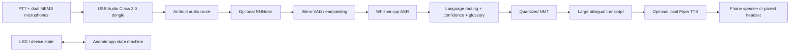
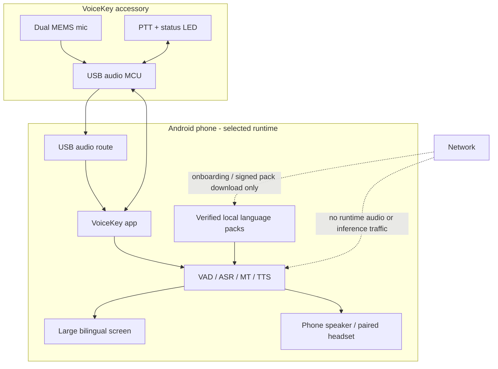

# TECHNICAL PROPOSAL

## Phase 2 - Technical Submission

| Item | Details |
|---|---|
| Team / Project Name | VoiceKey (working project name) |
| Submission Date | 21/08/2026 |
| Version | v1.4 - evidence-refresh and claim-boundary revision |
| Confidentiality | Restricted - Challenge Review Only |

> **Evidence boundary.** This proposal distinguishes validated external evidence from proposed product targets. Any size, latency, power, BOM, or quality number labeled "target", "budget", or "estimate" must be measured on the selected handset and prototype before it becomes a public claim. The proposal deliberately does not claim direct USB access to a phone NPU. A model card or repository being available also does **not** establish commercial redistribution eligibility.

---

## 1. Executive Summary

### 1.1 Problem Overview

People already carry powerful smartphones, yet generic translation apps can be awkward while speaking, phone microphones vary in noise, and cloud-dependent workflows can fail exactly where communication matters. The initial pilot hypothesis is that Vietnamese operators, foreign supervisors, technicians, and trainers need to exchange short instructions in factories, warehouses, field service, and onboarding; this target context must be validated through discovery and the supervised pilot. A mistranslated safety instruction can never be a safety control, but faster shared understanding may reduce avoidable delay and repetition. The reviewed adjacent products use Bluetooth earbuds, companion apps, or separate handheld screens; these patterns motivate a phone-attached, transcript-first alternative rather than prove market demand or performance. [M1][M2][M3][M4]

### 1.2 Proposed Solution

VoiceKey is a proposed compact wired USB-C companion for Android. It is designed to add two close microphones, physical Push-to-Talk, a visible recording LED, and an intended USB Audio Class path whose actual route, reconnect behaviour, and permissions must be verified on each supported handset; the Android app supplies the screen, battery, storage, and compute. After a signed language pack is installed, the release requirement is that VAD -> ASR -> neural machine translation -> optional TTS runs locally and presents a large bilingual transcript. The first scope is EN <-> VI; Southeast Asian languages expand only after language-specific quality gates pass.

### 1.3 Key Value Proposition

The intended value proposition is release-gated offline operation—no runtime API call after required packs are installed—combined with better interaction rather than redundant compute: wired capture, a hardware PTT, and a partner-visible transcript use the phone already in hand. EN <-> VI is held to Vietnamese-specific, real-context measurements before expansion. If those gates pass, the product will publish pair-specific packs, latency percentiles, supported phones, and privacy behavior rather than a universal accuracy claim.

---

## 2. Problem Definition & Target Users

### 2.1 Problem Statement

In cross-border operations, a short spoken instruction can be time-critical but not necessarily suited to a keyboard or an interpreter. Generic smartphone translation is accessible but requires a user to manage the phone screen, microphone distance, and turn-taking. Cloud translation adds a connectivity, privacy, and service-availability dependency. Standalone translators solve some interaction problems but impose extra hardware cost and still require the user to carry and charge another computer.

The first beachhead is not consumer travel. It is short, face-to-face conversation where a bilingual transcript, a tactile talk control, and predictable offline behavior are more useful than a broad catalogue of untested languages. The product is assistive: critical safety instructions must still use a defined confirmation/read-back process and local operating procedures.

### 2.2 Impact Analysis

| Impact Area | Current Pain Point | Consequence | VoiceKey Response |
|---|---|---|---|
| Safety / operations | Verbal instruction may be misunderstood; phone handling interrupts the task | Repetition, slow escalation, unsafe ambiguity | PTT separates turns; bilingual source/translation remains visible; read-back prompt for flagged terms |
| Productivity | Colleagues repeat or type short phrases; an interpreter is not always nearby | Waiting, rework, lower trainer capacity | Short-turn capture and large shared transcript reduce friction |
| Connectivity | Wi-Fi/mobile service can be unreliable or prohibited | Cloud app cannot complete a turn | Installed language pack runs with network disabled |
| Privacy | Audio/text may cross an external service without a clear policy | Data exposure and adoption resistance | Local-only runtime, no audio retention by default, visible recording state |
| Inclusion | Non-native speakers cannot verify what the app heard | Loss of trust and unequal participation | Source text and translated text are both shown and replayable |

### 2.3 Target Users & Use Cases

| User Segment | Language Need | Primary Context | Priority | First Use Case |
|---|---|---|---|---|
| Vietnamese frontline operator | VI <-> EN | Factory line, warehouse, field service | Critical | Receive/confirm a short task instruction |
| Foreign supervisor or trainer | EN <-> VI | Onboarding, quality check, maintenance | Critical | Teach a procedure with a shared transcript |
| Field technician / contractor | EN <-> VI | Installation, inspection, visitor support | High | Clarify a fault, part, measurement, or appointment |
| Operations / HR facilitator | EN <-> VI; later SEA pairs | Group intake or incident follow-up | High | Guided two-person conversation with history opt-in |
| Regional user, phase 2 | EN <-> ID / TH / MS / TL | Cross-border service/training | Gate | Text-first or voice pair after quality gate |

### 2.4 Key Design Constraints

| Constraint | Target / Requirement |
|---|---|
| Internet dependency | Zero at runtime after language packs are installed and verified |
| Primary latency target | P50 <= 2.0 s and P95 <= 3.5 s from VAD endpoint to final translated text for a 2-6 s utterance on the reference handset |
| Target environment | Indoor operational areas; 70-85 dBA noisy slices are mandatory in test. Outdoor/very loud sites need explicit limitations. |
| Launch language pair | English <-> Vietnamese speech, text, and optional local TTS |
| Phase 2 language policy | Indonesian, Thai, Malay, Tagalog first; Burmese, Khmer, Lao only after per-component evidence and test pass |
| Android baseline | Pixel 8 reference handset (Tensor G3, 8 GB LPDDR5X RAM); Galaxy S24 Ultra (exact market/carrier SKU recorded) and global-unlocked OnePlus 12 compatibility comparators; Android 13+ initially; USB host + compatible USB audio route; supported-phone matrix required [H9][H11][H12] |
| Form factor | <20 g, approximately 45 x 22 x 9 mm, short flexible USB-C pigtail; no dedicated screen/battery in v1 |
| Conversation mode | PTT / turn-based in v1. Continuous full-duplex is explicitly deferred until acoustic echo and thermal validation. |
| Privacy | Audio/text never leave the phone at runtime; history is opt-in and removable; recording state must be obvious |

---

## 3. Business Solution & Innovation

### 3.1 Industry Problem & Solution Fit

Within the reviewed product set, the adjacent offerings have different hardware, connectivity, and screen patterns; none is a direct substitute for the proposed USB-C, phone-attached, offline-first workflow. This is a bounded market observation, not a claim that no competitor exists.

| Existing Approach | Specific Failure Mode or Trade-Off | VoiceKey Response |
|---|---|---|
| Phone-only translation app | Good screen but uncertain mic geometry, no tactile control, and weak physical differentiation | Proposes wired dual-mic capture, PTT, and a recording LED while retaining the phone screen; comparative benefit remains a pilot test |
| Bluetooth translation earbuds | Pairing/battery/app friction; partner-visible text is secondary; hardware scope expands into music/calls | Targets a wired UAC2 path whose actual routing, reconnect, and permission behavior must pass per-handset tests; makes bilingual text the primary shared surface |
| Standalone translator | Duplicates screen, battery, radio, compute, charging, and enclosure | Reuses the user's Android phone; accessory remains low-power and upgradeable |
| Cloud meeting/translation service | Connectivity and data-transfer dependence; poor fit for short face-to-face turns | Release-gated no-runtime-network requirement after pack installation, local processing, and clear retention policy |

This positioning is based on official product/experience evidence from Timekettle, Vasco, and Pocketalk. The reviewed Timekettle pages show handheld and earbud/app patterns; Vasco separates phone-paired earbuds from a SIM-backed handheld; and Pocketalk's manual documents screen, text-size, and history controls. [M1][M2][M3][M4][M5]

### 3.2 Innovation & Competitive Strengths

| Dimension | Existing Solutions | VoiceKey |
|---|---|---|
| Connectivity | Coverage varies by device, mode, eSIM, app, and cloud service | Release test: network disabled after pack install; no runtime fallback is permitted |
| Interaction | Bluetooth pairing, taps on screen, or a separate handheld | USB-C attachment, hardware PTT, status LED, and large phone transcript |
| Audio capture | Phone mic or earbud microphone, often optimized for a different task | Dual-mic, close-use front end designed for short commands and turn segmentation |
| Screen / partner visibility | Handhelds have a screen; earbuds depend on a companion phone UI | Phone is intentionally the shared bilingual display, not an afterthought |
| Hardware economics | Handheld duplicates phone hardware; earbuds require battery/case | Low-power USB audio companion; no display, battery, modem, or AI SoC in v1 |
| AI architecture | Opaque service or one broad model claim | Modular ASR/MT/TTS; measured device, pack, and language-pair limits |
| Privacy | Cloud/online mode may be integral or ambiguous | Release requirement: local runtime audio/inference with opt-in data retention, verified by egress and retention tests |

The innovation is therefore a **compute-and-interaction split**: the phone supplies the screen, storage, battery, and candidate local-inference runtime, while the accessory is intended to improve capture consistency, tactile turn-taking, and visible state for live work. Comparative capture/UX superiority is a release claim only after the paired noisy-slice and field-task tests. This design creates a lower hardware surface than an autonomous translator while providing a more intentional communication UX than a generic app.

### 3.3 Initial Business Model and Route to Market

The primary route is B2B/B2B2C pilot deployment, not a commodity travel gadget launch. A pilot kit includes Link hardware, the offline Android app, an EN-VI language pack, deployment guide, and an evidence report from the site-specific test set. Revenue can come from hardware and a separately priced, opt-in enterprise service for signed language-pack updates, glossary management, device management, and validation support. The offline core remains usable without a recurring cloud inference fee.

The first commercial proof is a 10-30 user supervised pilot in one operational context. Success is measured by task completion, repeated-instruction reduction, privacy acceptance, and transparent error/fallback behavior - not only download count or claimed language count.

### 3.4 Social, Retail, and Demo Lessons

Public social and retail links are useful for discovering product formats but not for substantiating performance. M6-M9 are social/retail context only; M11-M16 are the reproducible video demos reviewed here. The Douyin/Facebook/TikTok items are retained only as low-confidence promotional or retail context because they were not reliably reproducible in this evidence pass; no specific product behaviour is attributed to them. [M6][M7][M8][M9]

This review also records six accessible product videos from official channels and independent reviewers: Pocketalk setup/conversation demonstrations, a Pocketalk enterprise-app activation flow, Vasco E1 and V4 demonstrations, and a W4 Pro-versus-E1 comparison. They prove a visible workflow, form factor, or deployment path only; none is a latency, accuracy, or offline benchmark. [M11][M12][M13][M14][M15][M16] Our own demo must be stronger: show Airplane Mode, selected pack version, phone model, live latency overlay, source/target text, and a failure case.

<!-- pagebreak -->

### 3.5 Market Price Structure and Recommended Commercial Model

Public retail prices are useful market anchors, not a recommended VoiceKey list price. During the 20-21 August 2026 review, the Timekettle W4 Pro US-facing page showed $381.65 sale / $449 regular, but the same page mixed “no subscription required” messaging with paid offline-pack terms after two free coupon pairs and an optional $14.99/month iOS plan. Treat that as a dated US-store snapshot, not a stable global price. The captured Vasco E1 and V4 product pages recorded $389 and $449 respectively. These are different product classes and bundles; locale, promotion, data plan, language-pack, and warranty conditions can change the total. [C1][C2][C3]

| Comparator pattern | Public cost structure observed | What it teaches VoiceKey |
|---|---|---|
| Timekettle W4 Pro earbuds + app | Dated US-store snapshot: hardware purchase; the same page advertises core modes as no-subscription, while offline packs have two coupon pairs and then $10 per pair or a paid subscription; some iOS call/video modes are in a $14.99/month plan | Do not describe a one-time hardware price as the whole cost of ownership. Separate the language-pack and optional feature terms. [C1] |
| Vasco E1 earbuds | $389 hardware; the conversation workflow pairs to a phone or Vasco device | A wearable conversation UX is already priced as premium hardware; OneVoice should compete on phone-visible text and offline boundaries, not music-earbud features. [C2] |
| Vasco V4 handheld | $449 hardware with a built-in SIM and vendor-claimed lifetime connectivity | Bundled connectivity can simplify travel but is a recurring supplier exposure, not offline operation. OneVoice reuses the phone and avoids this hardware/data burden. [C3] |
| Pocketalk S2 Plus handheld / Enterprise App | S2 Plus: $349.95, complimentary five-year data, and no offline mode on the public product page. Enterprise App / Ventana has separate managed-deployment documentation and no observed public price. | The direct B2B alternative may be software deployment, not only another device. OneVoice must make Android fleet support and offline verification explicit. [C4] |

**Recommended commercial structure (proposal, not a final price card):** charge a transparent hardware kit price, a one-time site onboarding/validation fee, and an optional managed-service fee for signed pack updates, glossary governance, device administration, and support. The offline core must remain usable without cloud inference or a mandatory monthly translation fee. Set any list price only after two contract-manufacturer quotes, warranty/return assumptions, and a measured support burden exist.

**Comparator boundary.** Comparator retail prices are category anchors, not a VoiceKey deployed-TCO or price comparison. They exclude or bundle different handset, connectivity, warranty, language-pack, support, tax, and channel terms. VoiceKey's base case assumes a customer-provided handset from the supported-device matrix; any loaner or managed-phone offer is separately scoped and priced.

| Commercial decision | Evidence required before decision | Current status |
|---|---|---|
| Hardware-kit price | Two comparable CM quotes, selected BOM/configuration, MOQ/lead time, yield, packaging, freight, tax/channel assumptions | Open |
| Warranty and RMA | Warranty duration, failure/replacement reserve, return shipping, repair/refurbish owner, support response boundary | Open |
| BYOD vs managed phone | Exact supported-handset policy, owner of handset/MDM/loss/damage/OEM warranty | Open |
| Deployment fee | Site acceptance scope, training, glossary/pack setup, travel/site-access assumptions | Open |
| Optional managed service | Included pack/update/governance/admin/support scope, billing unit, service level; confirm zero cloud-inference dependency | Open |

---

## 4. AI Approach & Technical Design

### 4.1 System Pipeline Overview



The cascade is deliberate. It makes ASR, translation, terminology, TTS, and UI independently observable and replaceable. More importantly, the PhoST English-Vietnamese benchmark reports 508 audio hours and 331K triplets, and found its traditional cascaded approach outperforming a modern end-to-end approach. That makes cascade-first an evidence-led EN-VI MVP choice rather than a fallback. [A21] Direct multilingual speech translation remains a research direction, but SeamlessM4T's experimental on-device small export does not cover Vietnamese and its larger variants are not a credible v1 mobile thermal/memory commitment. [A5][A6][A7]

### 4.2 Module-by-Module Design

The values below are initial engineering budgets, not benchmark results. The model bake-off replaces every range with a measured artifact size and latency on the reference phone.

| Module | Candidate Model / Framework | Size Budget | Latency Budget | Key Technique |
|---|---|---:|---:|---|
| Audio capture | UAC2, dual MEMS mic, Android `AudioRecord` | Firmware/config only | Continuous | Wired capture; PTT separates turns |
| VAD | Silero VAD | ~2 MB class | <20 ms per chunk target | Endpointing, silence gating, speech confidence. Repository-level speed is an engineering lead, not an independent benchmark. [A8] |
| Denoise | RNNoise, feature-flagged | Small | <20 ms per chunk target | Enable only when field WER improves [A9] |
| ASR | Standard Whisper base/small via whisper.cpp; PhoWhisper as a compatibility-gated evaluation alternative | ~0.1-0.6 GB quantized class | 0.4-1.2 s after endpoint target | Quantization, partial/final decode, EN-VI test. PhoWhisper is Vietnamese-specific ASR evidence, not a promised mobile runtime; conversion/reproducibility and every artifact's licence remain gates. [A1][A2][A22] |
| MT shipping candidate | Pair-specific OPUS-MT EN-VI and VI-EN; native/ONNX runner selected only after bake-off | ~0.08-0.3 GB class | <0.35 s target | Smaller bilingual route and measured terminology/quality gate. The cards show Apache-2.0, but the release ledger must still cover weights, tokenizer, code/runtime, and provenance. [A18][A19] |
| MT research comparator | NLLB-200 distilled 600M, non-commercial benchmark pack only | ~0.6-1.2 GB class | Research measurement only | Broad multilingual coverage is useful for research; its model card is CC-BY-NC/research and says it is not released for production deployment. It is excluded from a commercial release absent explicit rights. [A3][A4] |
| Terminology guard | Local glossary + protected spans | <10 MB | <30 ms target | Proper nouns, approved terms, numbers, read-back marker |
| TTS | Piper/VITS through Sherpa-ONNX | ~20-150 MB per voice | <0.6 s to first audio target | Lazy load; separate EN and VI packs. Voice existence does not prove licence fit or intelligibility; both are release gates. [A10][A11][A12][A24] |
| UI / history | Kotlin/Compose + encrypted local store | App dependent | <50 ms render target | Large font, source/target, confidence/fallback state |

**Commercial model-release gate (non-negotiable).** NLLB-200 may inform a non-commercial bake-off, but it is not a default or fallback shipping pack. Quantization never changes a model licence. Before any package is offered to users, the release ledger must identify the licence and redistribution status for model weights, tokenizer, training-data obligations, code/runtime, and each voice; an unavailable or non-commercial component blocks that pack. [A4][A18][A19]

### 4.3 On-Device Optimization & Memory Management

1. **One language route at a time.** The app never loads all Southeast Asian packs together. It holds one ASR model, one MT route, and only the requested target TTS voice.
2. **Quantization is a measured decision.** Candidate builds are INT8 or weight-only quantized, but translation quality, not size alone, decides the release artifact. Quantization does not change licence terms: NLLB is excluded from a commercial release unless explicit commercial rights are obtained. CTranslate2 documents useful quantization options; it is not evidence of Android readiness and is not presumed to be the final runtime. [A4][A20]
3. **Lazy and staged loading.** VAD stays resident; TTS waits until final translation; model load is warmed during the language-selection screen when thermal/battery policy allows.
4. **Adaptive quality control.** If sustained real-time factor, P95 latency, or thermal guard trips, the app reduces model tier or disables optional TTS. It never silently switches to cloud.
5. **No hot model streaming from the accessory.** Active weights are verified in app-private storage and mapped into phone memory. The dongle can later hold an encrypted installer/cache, but that is not the inference path.
6. **Language-pack integrity.** Every pack has version, SHA-256 hash, signature, licence manifest, supported-pair list, and test report. Verify signature and hash before installation and again before first load after an update; failure blocks model loading with a visible offline error, never a partial online fallback.
7. **Reproducible release ledger.** The signed pack registry records source revision, model/voice/tokenizer/runtime bill of materials, commercial eligibility, artifact hash, and rollback compatibility. A missing provenance or per-voice redistribution record leaves that component evaluation-only.

The initial memory ceiling is 1.8 GB active inference/RAM for the advanced pack on the reference high-end phone, with a lighter EN-VI fallback targeting lower memory. Final ceilings are selected only after the bake-off and 30-minute thermal soak.

### 4.4 Robustness & Edge Case Handling

| Challenge | v1 Handling | Escalation / Fallback |
|---|---|---|
| Noise / echo | Close-use mic geometry, PTT, VAD; RNNoise only when proven beneficial | Ask user to repeat; show source text; no deceptive result |
| Multiple speakers | Explicit turn-taking; v1 is not a multi-speaker diarization product | Separate turns; defer group mode |
| Accent / dialect | Evaluate Northern/Central/Southern Vietnamese and accented English | Publish support limitations and collect consented improvement samples |
| Code switching | Preserve source transcript and language confidence; test EN-VI switches | Ask for a single-language rephrase if confidence is low |
| Numbers / proper nouns | Local protected spans and read-back prompt | Highlight uncertain segment instead of guessing |
| Silence / rapid speech | VAD thresholds and maximum turn duration | Prompt "No clear speech" or split turn |
| Missing pack / thermal limit | Explicit offline/temperature state | Text-only, lower model tier, or stop with a clear reason |
| Safety-critical phrase | Show both texts and a confirmation/read-back instruction | Not a replacement for local safety procedure |

### 4.5 Accuracy and Evaluation Plan

Public component datasets are necessary but insufficient. PhoST is the primary EN-VI speech-translation anchor; PhoWhisper provides Vietnamese-specific ASR evidence from an 844-hour, accent-diverse fine-tuning set; PhoMT provides 3.02M EN-VI sentence pairs for text translation evaluation; and PhoAudiobook supports a Vietnamese-specific TTS evaluation path. [A21][A22][A13][A24] FLEURS, CoVoST 2, and CVSS remain useful for multilingual test design, but they do not replace a small consented target-context conversation set. [A14][A15][A16]

| Layer | Metrics | Required Test Slices |
|---|---|---|
| ASR | WER, CER, RTF | Clean, 70-85 dBA noise, far-field, fast speech, code-switch, names/numbers, Northern/Central/Southern VI |
| MT | SacreBLEU, COMET, human adequacy, term exact match [A25][A17] | FLORES-200 [A3] / PhoMT holdout [A13], ASR-noisy source text, operational glossary, short fragments |
| TTS | Intelligibility, MOS, pronunciation pass rate | Vietnamese names, digits, English loanwords, short replies, longer turns |
| E2E | P50/P95 endpoint-to-text, time-to-first-audio, task success, battery, temperature | 100+ turns, warm/cold start, three supported phone classes |
| Android/USB integration | Attach success, USB permission, actual capture route, reattach, foreground-service state, current profile | Pixel 8, Galaxy S24 Ultra (recorded market/carrier SKU), and global-unlocked OnePlus 12; screen lock, app restart, permission revoke, Airplane Mode, and 30-minute soak |
| Pack/security | Signature/hash verification, downgrade/rollback behavior, Clear All deletion | Tampered pack, missing provenance, invalid voice licence, update and first-load paths |
| Privacy | Runtime egress count, retention audit, status visibility | Airplane-mode test, traffic capture, Clear All test |

**v1 release gate:** the app must be fully usable in Airplane Mode after pack install; it must meet the Section 2 latency target on the reference handset; it must show a measurable ASR improvement over that handset's built-in microphone in the target noisy-use slice; and every shipping pack must pass the commercial-eligibility ledger. It must also survive the USB/permission/route matrix above, with the actual external input route verified while recording. If either the hardware, model, route, or licence gate fails, the product must not claim it.

---

## 5. Hardware & Device Concept

### 5.1 Platform Selection & Justification

| Criteria | Phone-only App | USB Audio/Mic Companion | Autonomous Edge Translator | Selected |
|---|---|---|---|---|
| Compute | Phone CPU/GPU/vendor delegate | Phone CPU/GPU/vendor delegate | Own SoC/NPU/RAM required | USB companion |
| Hardware power | None beyond phone | <350 mW accessory target | Multi-watt compute + battery/thermal system | USB companion |
| Model agility | Good | Good: app packs update independently | Harder OTA/storage validation | USB companion |
| Audio interaction | Phone microphone only | Dedicated dual mic, PTT, LED | Can be good, but all hardware must be built | USB companion |
| Screen / UI | Phone | Phone, partner-visible transcript | Needs own display or companion app | USB companion |
| BOM / certification | Lowest, no differentiated hardware | Moderate, manageable v1 | Highest: radio/battery/SoC/enclosure | USB companion |
| Product fit | Weak differentiation | Matches required Type-C attachment | Misaligned with compact companion goal | USB companion |

The selected platform is a **low-power USB Audio Class 2.0 peripheral**. The Android phone is USB host and provides the bus power. Android documents the host/accessory distinction and USB audio support; modern Android policy and runtime behavior still require a phone compatibility matrix. [H1][H2]

**Reference engineering platforms (not benchmark results):** Pixel 8, with Tensor G3 and 8 GB LPDDR5X RAM, is the control handset for all initial pack-size, RAM, latency, battery, and thermal targets. Galaxy S24 Ultra is the Samsung/One UI comparator; OnePlus 12 is the non-Samsung Snapdragon comparator. The planned demo build starts CPU-first and may use the LiteRT GPU delegate only when the measured model/runtime combination supports it; it assumes neither direct USB access to, nor a required dependency on, a vendor NPU. [H7][H9][H11][H12]

**Host-compute comparison is a test plan, not a TOPS claim.** The dongle never selects or accesses a phone NPU; every host is evaluated through the Android app/runtime actually measured. Each purchased or borrowed handset must be recorded by exact retail SKU, carrier state, region, Android build, free storage, and battery-health state before a result is compared or published. Samsung processor configurations can vary by market, so the actual tested SKU—not a family name—is the compatibility claim.

| Compute reference | Pixel 8 / Tensor G3 | Galaxy S24 Ultra / Samsung-market SKU | OnePlus 12 / global-unlocked SKU |
|---|---|---|---|
| Published RAM / storage options | 8 GB; 128 / 256 GB [H9] | 12 GB; 256 / 512 GB / 1 TB in Samsung US materials [H11] | 12 / 16 GB; 256 / 512 GB options [H12] |
| Runtime path evaluated | CPU baseline; GPU only if measured | CPU baseline; GPU delegate only if measured | CPU baseline; GPU delegate only if measured |
| NPU/TOPS decision relevance | No direct USB or assumed NPU route | Same; Snapdragon path is measured, not presumed | Same; Qualcomm path is measured, not presumed |
| Required evidence | USB route, pack load, P50/P95, 30-minute thermal/battery result | Same, with exact market/carrier SKU recorded | Same, with global-unlocked SKU recorded |
| Selection status | Reference handset | Mandatory Samsung compatibility comparator | Mandatory non-Samsung Snapdragon compatibility comparator |

VoiceKey's nominal form is a 45 x 22 x 9 mm capsule attached through a short flexible USB-C pigtail. The pigtail is intentional: a rigid male plug risks bending the phone port during daily use. The device has no display and no internal battery in v1; phone display and speaker/headset are the user-facing I/O.

### 5.2 Key Hardware Components & Power Budget

| Component | Specification / Class | Target Active Power | Notes |
|---|---|---:|---|
| USB-C attachment | Male plug/pigtail, CC/ESD protection, USB 2.0 data | Low | Phone is host/source; no high-power PD assumption |
| USB audio controller | Low-power MCU with USB device + PDM/I2S/SAI | 20-80 mW class | UAC2 input, LED/button firmware, signed update |
| Microphone pair | 2 digital MEMS microphones | 10-40 mW class | Designed for speech capture; no claim of heavy on-dongle beamforming |
| Codec / audio front end | Stereo voice codec/ADC class | 20-60 mW class | Anti-alias, level/clock management as required |
| Button / LED | PTT, tricolor state LED | <20 mW class | Physical and visual privacy state |
| Flash / passives / ESD | Firmware/config storage, protection | Low | No model-storage data plane in v1 |
| Total accessory | USB audio companion | **Target <350 mW average** | Engineering target; validate on OEM phone matrix |

The power budget intentionally leaves AI compute in the phone. The design does not assume that any Android phone will source high USB-C power continuously; it stays in a low-power accessory envelope. USB-C/PD capability is not evidence that a phone should be used as a multi-watt accessory supply. Before release, the team publishes measured steady-state and peak current profiles for each supported phone class. Any brownout, repeated USB re-enumeration, or USB-audio route loss during the 30-minute soak is a release failure. [H3][H4]

**Full-system energy gate (not a battery-life claim):** On every reference SKU, run three repeats of each condition with the same app build, language pack, scripted turns, ambient condition, screen brightness, and Airplane Mode state: phone-only baseline; dongle attached but idle; and dongle attached with active translation. The minimum operational gate is a 30-minute active session without crash, thermal-throttle event, USB route loss, or re-enumeration. Report median battery-percent delta, peak surface temperature, attach/re-attach count, and actual capture-route stability by condition; do not publish an all-day or 8-hour claim until that result exists.

| Requirement | Current truthful position |
|---|---|
| Total system power / operational duration | Accessory target is <350 mW average. Full host-plus-accessory evidence is the controlled three-condition, three-repeat 30-minute protocol above; publish median battery delta and temperature rather than infer duration from battery capacity. No standalone or 8-hour battery-life claim is made before that measurement. |
| Environmental rating | No IP, drop, temperature, or other environmental certification/rating is claimed for v1. Pilot use is limited to validated indoor conditions until mechanical/environmental evidence exists. |

### 5.3 Indicative BOM Feasibility

All figures in this section are USD planning estimates or current component-listing anchors, not supplier quotations, commitments, or a final selling price. They are deliberately separated by development stage because prototype assembly, rework, and enclosure iteration dominate small volumes. The six block rows below have exclusive inclusion boundaries; they are component-calibration anchors, not a purchase order or a substitute for the complete-unit quote bands that drive pilot cash. [C5]

| Scale | Estimated complete companion cost per unit | Included boundary | Decision use |
|---|---:|---|---|
| EVT: 10 units | $45-$70 | Board, simple enclosure/pigtail, basic assembly and test | Choose the simplest audio/USB architecture that works |
| Pilot: 30-40 units | $38-$60 | Better assembly price, spares/rework still material | Validate support and replacement assumptions |
| Preproduction: 100 units | $30-$45 | More stable assembly/component pricing, still pre-DFM | Start price/warranty conversation only after quotes |

| BOM block | Engineering cost range per unit | Evidence / validation boundary |
|---|---:|---|
| USB connection | $1.50-$4.00 | One cable/plug/pigtail, CC implementation, ESD, and connection-specific passives exactly once. Excludes enclosure, general PCB passives, and any second pigtail. A passive USB-data attachment is the v1 default; a PD controller is a price anchor, not a required part. [C5] |
| MCU / audio bridge | $7.00-$10.62 | UAC2 enumeration, reconnect, signed firmware update. [C5] |
| Codec / audio front end | $7.38-$13.58 | Clocking, clipping, SNR, and mic-interface validation. [C5] |
| Two digital MEMS microphones | $2.10-$4.26 | Compare against the phone microphone in noisy target slices. [C5] |
| Controls and PCB | $3.15-$8.60 | Button, LED, PCB, and non-USB passives only. Excludes CC/ESD/cable/pigtail already allocated to USB connection. |
| Enclosure, assembly, and test | $9.00-$28.00 | Enclosure, strain relief, low-volume assembly/test, yield, cosmetic, and rework validation. Excludes cable/pigtail already allocated to USB connection. |

**Cost-boundary rule.** Select one Type-C configuration in the schematic—passive USB-device CC or a named controller configuration—and exclude the unselected option. Do not turn these cross-volume/public-listing anchors into a formal BOM subtotal; the complete-unit bands above are only re-baselined after a selected configuration, production quantity, and two CM quotes exist.

An autonomous device would add a compute SoC, LPDDR/UFS, thermal design, battery/charging, display, speaker, enclosure space, firmware/OTA, and additional certification. Those components have no proportional v1 value because the phone already supplies them.

### 5.4 Prototype, Test, and Device Equipment

The following is the minimum practical bench for an evidence-led EVT and pilot; it makes the hardware/software cost boundary visible instead of hiding it in the dongle BOM.

| Equipment / device | Purpose | Planning outlay | Buy / borrow decision |
|---|---|---:|---|
| Three Android test phones (Pixel 8, Galaxy S24 Ultra, global OnePlus 12) | USB-audio compatibility, sustained inference, thermal matrix; exact SKUs/regions recorded | $600-$2,500 | Buy or borrow before model/hardware freeze |
| USB power meter/current monitor + bench supply | Accessory draw, phone-source behaviour, brownout diagnosis | $95-$420 | Required baseline bench |
| Logic analyser + oscilloscope | USB/firmware timing, reset, rail and signal debugging | $210-$2,000+ | Borrow professional equipment where possible |
| Soldering/rework kit | EVT rework and board bring-up | $100-$400 | Required if no partner lab |
| Audio and thermal checks | SPL/reference mic or headphones; IR thermometer/camera | $70-$900 | Required at least at basic level for pilot evidence |
| 3D-print/prototype enclosure iterations | Fit, pigtail strain relief, ergonomics | $50-$300 per iteration | Outsource initially |

If a lab already exists, the incremental equipment budget is approximately $300-$1,200. Building most of the bench from scratch is approximately $1,000-$4,500; a more professional scope, thermal camera, and audio instrumentation can take it to $2,000-$8,000. These are planning bands, not a procurement recommendation. [C5]

### 5.5 Hardware Risk Controls

- Use standard UAC2 first, not a proprietary audio transport or Android accessory mode.
- Declare `android.hardware.usb.host`, use an attached-device filter for the shipped VID/PID, obtain USB permission, and test that permission journey. Android host capability is not guaranteed across phones. [H1]
- Test Pixel 8, Galaxy S24 Ultra (exact market/carrier SKU), and global-unlocked OnePlus 12 before locking the BOM. Each must pass attach, detach, reattach, screen-lock, app-restart, Airplane Mode, permission-revoke, and the controlled 30-minute soak tests with the shipping dongle. A different SKU, region, Android build, or processor configuration is a new matrix entry, not an assumed pass. [H9][H11][H12]
- Treat `AudioRecord.setPreferredDevice()` only as a request. Once capture has started, verify the actual `getRoutedDevice()` identity and route-change callback; if the companion input is not active, stop the external-microphone state and show a visible phone-mic fallback rather than claiming external capture. [H10]
- Measure peak and steady-state current per supported phone class; a brownout, repeat enumeration, or route loss is a release failure.
- Do not add power pass-through charging in v1; it changes Type-C role/PD and compliance risk.
- Keep full acoustic echo cancellation and beamforming out of the dongle v1. Only add local DSP after a measured audio advantage exists.
- Use signed firmware updates and a minimal interface surface. The accessory has no cellular/Wi-Fi radio and no user audio storage.

---

## 6. System Architecture & Integration

### 6.1 Software Stack

| Layer | Component / Framework | Role |
|---|---|---|
| Android OS | Android 13+ initially | USB host, actual audio-route verification, permission/foreground-service lifecycle, display, power/thermal signals |
| App layer | Kotlin + Jetpack Compose | Language-pack UX, transcript, accessibility, state machine, local settings |
| Native layer | C++ via JNI | Low-overhead, explicitly managed audio/model orchestration and buffers |
| USB / audio | Android audio stack + UAC2 | Capture companion mic only after actual route verification; otherwise a visible phone-mic fallback, never an unqualified external-mic claim |
| VAD / denoise | Silero VAD, optional RNNoise | Turn segmentation and acoustic conditioning |
| ASR | whisper.cpp standard Whisper baseline; PhoWhisper compatibility-gated evaluation path | Quantized multilingual speech-to-text; no claim that every PhoWhisper checkpoint directly runs in whisper.cpp |
| MT | OPUS-MT EN-VI / VI-EN shipping candidate; NLLB research-only comparator pending explicit commercial rights | EN-VI translation with evidence-led future routing |
| TTS | Sherpa-ONNX / Piper | Optional local speech output |
| Model management | Signed local pack registry + release ledger | Version, hash, signature, licence/provenance, package state, offline readiness |
| Security / privacy | Android Keystore + encrypted history | Local-only records, opt-in retention, clear/delete |

### 6.2 Build, Verification, and Deployment Toolchain

| Capability | Required hardware/software | Cost boundary and acceptance evidence |
|---|---|---|
| Android product build | Android Studio, Kotlin, NDK/JNI, USB-host feature/device filter, runtime USB and microphone permissions | Toolchain licence cost is $0; prove actual audio routing and foreground microphone policy on the supported phone matrix. [H1][H5][H10] |
| Native model integration | C/C++ bindings, reproducible model-pack build, hash/manifest generator, profiler and thermal logging | Treat `whisper.cpp`, an OPUS-MT native/ONNX runner, and Sherpa-ONNX as candidate runtimes. NLLB remains non-commercial benchmark-only. A model/repository is not a device-performance proof. [A2][A4][A20] |
| Source control and CI | Private Git repository, automated unit/integration test, signed release artifact | $0-$50/month is a planning band depending on repository/runner use; retain a versioned test report with every pack. |
| Pilot app distribution | Managed internal APK/private channel first; Google Play only when the pilot needs it | No cloud inference is budgeted. Google Play registration is a $25 one-time fee if selected. [C6] |
| Field measurement | Latency harness, device/pack inventory, consented task log, raw-audio retention disabled by default | Store aggregate measures and defect reports; do not upload conversation audio just to obtain pilot analytics. |
| Licence and security review | Model cards, weights/tokenizers/data/voice licences, runtime/code SBOM, firmware-signing key process | Required before EVT exit; an available voice/model is not automatically commercial-shipping eligible. [A4][A10][A24] |

**Android capture release rules.** Live capture must use a foreground service declared with `android:foregroundServiceType="microphone"`, declare `FOREGROUND_SERVICE_MICROPHONE`, and obtain `RECORD_AUDIO` before it starts. It cannot be silently started from the background; if the service or permission is unavailable, the app fails closed with a visible microphone state. [H5] The app uses `setPreferredDevice()` only as a preference, then checks `getRoutedDevice()` while recording and subscribes to route changes; the UI says “external microphone unavailable — using phone microphone” whenever the external route is not actually active. [H10]

### 6.3 Architecture Diagram



### 6.4 Offline-First Design Principles

1. All active models, tokenizers, glossary data, and TTS voices are installed and verified before field use.
2. Runtime network clients are disabled for translation. Airplane Mode is a release test, not a marketing demonstration.
3. Every language-pair screen explicitly identifies what is installed: ASR, MT, TTS, and version.
4. Audio is processed in RAM and discarded by default. History is off until the user enables it.
5. The app never converts an offline failure into an invisible cloud request.
6. Unsupported pairs show a clear block with an installation requirement, not an approximate translation.
7. Firmware and pack updates are signed and versioned; verify both signature and hash before install and again before first use after an update. Any verification failure blocks model loading with a visible offline error.
8. Clear All deletes transcripts, raw-audio buffers, caches, and derived indexes in app-private storage. Pack and firmware rollback paths are explicit, versioned, and tested.

### 6.5 Privacy, Safety, and Failure UX

The visible LED and app status must agree: Ready, Recording, Translating, Result, and Error. A user should never wonder whether audio is still being captured. The app also provides "No clear speech", "Language pack missing", "External microphone unavailable — using phone microphone", "Please repeat", and "Device not supported" states. This is materially better than returning an unqualified answer when confidence, acoustic conditions, model availability, or the actual capture route are weak.

For safety-relevant content, the UI presents source and target text, highlights protected terms/numbers, and prompts an explicit read-back confirmation. VoiceKey assists communication; it is not a certified safety system and cannot replace written procedure, qualified interpretation, or emergency protocol.

---

## 7. Team Profile & Project Timeline

### 7.1 Role-Based Team Profile

This concept proposal intentionally does not invent personal names or credentials. It is technically complete as a research-backed design, but it is **not a formal submission** until the filing team replaces every owner label below with its actual person, organization, role, credentials, and contact data.

| Name / Owner | Role | Required Expertise | Contribution Area |
|---|---|---|---|
| Named submitting member (required) | Product & Systems Lead | Product discovery, systems trade-offs, partner pilot design | Scope, user safety boundary, success metrics, product decision log |
| Named submitting member (required) | ML / Speech Lead | ASR, NMT, TTS, evaluation, model licensing | Model bake-off, quantization, WER/COMET/MOS evaluation |
| Named submitting member (required) | Android / Edge Lead | Kotlin, C++/JNI, mobile inference, Android policy | UAC capture, offline pack system, app, thermal/privacy integration |
| Named submitting member (required) | Hardware / Acoustic Lead | USB-C, UAC2, PCB, MEMS mic, firmware, DFM | Dongle EVT, power, firmware signing, acoustic/device matrix |
| Named submitting member (required) | UX / Field Research Lead | Accessibility, operational research, multilingual usability | Transcript UX, pilot protocol, demo, failure-state usability |

### 7.2 Project Timeline

| Phase | Milestone | Key Activities | Target |
|---|---|---|---|
| 1 | Requirements and baseline | Provision the reference handset, define EN-VI use cases, phone-only offline baseline, commercial-eligibility/provenance review | T+2 weeks |
| 2 | Model selection and optimization | ASR/MT/TTS bake-off, quantization, pack-size/RAM/thermal measurement, shipping-candidate and research-only separation | T+5 weeks |
| 3 | Hardware EVT and Android integration | UAC2 dual-mic board, USB permission/actual-route/reconnect test, PTT/LED, app transcript | T+8 weeks |
| 4 | End-to-end pilot | 100-turn protocol, noise/device matrix, glossary, privacy/airplane-mode/foreground-service audit | T+11 weeks |
| 5 | Expansion decision | One SEA text/voice pack proof or explicit defer, 30-minute soak, supported-phone list | T+13 weeks |
| 6 | Finalization and submission | Reproducible demo, BOM quote gate, evidence report, proposal/video/packaging | T+16 weeks |

### 7.3 Early Demonstration Plan

The first demonstration is intentionally staged:

1. **Week 2:** phone-only Airplane Mode EN-VI baseline, with source/target transcript and model versions visible.
2. **Week 8:** attached UAC2 dongle shows PTT, LED, the verified external audio route (and visible phone-mic fallback), and reconnect behavior on three phones.
3. **Week 11:** noise/thermal report and 100-turn scenario test.
4. **Week 16:** a 90-second evidence-led video, not a scripted-only social clip. Appendix B provides the shot list.

### 7.4 Pilot Economics, Deployment, and Benefit Gate

The pilot budget is presented in two separate layers: direct cash required to run the pilot, and non-recurring engineering (NRE) required to make the product credible. Mixing them would make a small pilot look either artificially cheap or falsely profitable.

**Quantity policy used below.** Each pilot has a 10% usable spare pool, rounded up, plus a 15% manufacturing yield/rework allowance applied consistently as `production units = ceil(usable units / 0.85)`. This is a planning policy, not a supplier-yield claim; it prevents the high end of a range from silently using a different quantity basis.

| Pilot | Active users | Usable spares | Usable units | Production units | Unit-cost band used | Hardware cash |
|---|---:|---:|---:|---:|---:|---:|
| 10-user | 10 | 1 | 11 | 13 | EVT $45-$70 | $0.585k-$0.910k |
| 30-user | 30 | 3 | 33 | 39 | Pilot $38-$60 | $1.482k-$2.340k |

| Scope | Direct cash estimate (excluding NRE) | Included boundary |
|---|---:|---|
| 10-user pilot, BYOD | $2.835k-$9.210k | Sum of 13 production dongles, simple fixture, packaging, field-support/onboarding reserve, and replacement reserve |
| 10-user pilot with two loaner phones | $3.435k-$10.710k | BYOD case plus an explicit $0.60k-$1.50k loaner provision |
| 30-user pilot, BYOD | $5.582k-$17.640k | Sum of 39 production dongles, fixture, field support, packaging, and returns reserve |
| 30-user pilot with two-to-four loaner phones | $6.582k-$21.640k | BYOD case plus an explicit $1.00k-$4.00k loaner provision |
| Test-lab/device capital, if not borrowed | $0.90k-$7.00k once | Three engineering phones plus a basic bench; excluded from the pilot totals and NRE labor bands |
| Lean MVP NRE | $65k-$95k | Non-additive scenario; release only after an approved WBS hour-cap ledger identifies included workstreams. Formal compliance lab work remains quote-required. |
| More realistic first-release NRE | $95k-$145k | All-workstream planning maximum rounds the displayed $144.6k WBS maximum; pre-scan/advisory is named separately and formal compliance remains quote-required. |

The BYOD amounts are explicit sums of direct-cash line items using the stated quantity policy. The NRE pilot-setup labor is pre-deployment engineering; field-period support is a separate operational reserve, and the same staff time must not be counted in both layers. Test-lab capital is shown independently so it cannot disappear into either pilot or NRE totals. These are planning bands derived from public component/lab/workforce anchors and are not quotes. Before procurement, the financial ledger assigns each cost to exactly one bucket: NRE, direct pilot cash, capital, later recurring OPEX, or explicitly excluded/site-funded; it also names handset/MDM, warranty, loss/damage, travel/site access, tax/import, insurance, formal compliance, and legal/privacy owners. Re-baseline with two CM quotes, the actual target-phone policy, and the team's local cost rate. [C5][C7]

**Recommended pilot sequence:**

1. Measure a phone-only offline baseline against the same task script before distributing a dongle.
2. Deploy a closed 10-user BYOD pilot with one supported phone class and a 10% spare pool.
3. Expand to 30 users only if USB route stability, Airplane Mode, thermal soak, and the hardware-versus-phone-mic comparison pass.
4. Price any wider rollout from observed replacement, support, and pack-maintenance costs rather than from a competitor retail sticker.

**Benefit model - measure, do not assume.** The site records avoided bilingual-assistance minutes, time from utterance to confirmed instruction, repeat/clarification loops, escalation to a bilingual colleague, and support tickets per active user. For the ROI metric below, the 12-month period begins at pilot deployment and uses observed values from that period. Use mutually exclusive benefit and cost buckets:

```text
12-month gross benefit =
  (avoided interpreter hours during the 12-month period x site-approved hourly value)
  + (non-overlapping task hours saved during the same period x loaded site labour rate)

12-month direct-pilot cost =
  direct pilot cash
  + (12-month support + replacement + distribution not already included in direct pilot cash)

12-month direct-pilot ROI (%) =
  ((12-month gross benefit - 12-month direct-pilot cost)
   / 12-month direct-pilot cost) × 100

Ongoing annual net benefit after the pilot =
  (avoided interpreter hours x site-approved hourly value)
  + (non-overlapping task hours saved x loaded site labour rate)
  - (ongoing support + replacement + distribution not already included in direct pilot cash)
```

The 12-month direct-pilot cost includes direct pilot cash and only the 12-month operating costs not already recorded there; it excludes NRE and test-lab/device capital. Each observed avoided minute is assigned to one benefit bucket only. The measurement ledger identifies whether a cost is direct pilot cash, later recurring OPEX, NRE, or capital; no row may appear in two buckets. For a product-investment ROI, allocate NRE and lab capital once across a stated portfolio and 12-, 24-, or 36-month horizon; do not subtract amortised capital in the numerator and also include the same full capital in the denominator. An illustrative BLS May 2024 median-wage proxy: 30 users avoiding one hour of bilingual assistance per user per month produces 360 hours/year; multiplied by the US BLS interpreter/translator median-wage proxy of $28.58/hour, that is about $10,289 gross annual value. It is neither a bill rate nor a realised VoiceKey benefit; use a site-approved hourly value for a decision-grade case. [C7]

---

## 8. Submission Checklist

| # | Checklist Item | Status |
|---:|---|---|
| 1 | Executive Summary written, within the requested proposal scope | Done |
| 2 | Problem Statement, Target Users, and Design Constraints completed | Done |
| 3 | Business Solution, industry gap, and competitive differentiation completed | Done |
| 4 | AI pipeline, candidate models, optimization, robustness, and evaluation plan documented | Done as technical design; benchmark evidence pending execution |
| 5 | Hardware platform, form factor, indicative BOM, and power strategy completed | Done as technical design; supplier quote and EVT measurements pending |
| 6 | Role map and realistic timeline documented | Prepared; actual roster, credentials, and contacts remain a submitting-team input |
| 7 | Formal identifiers, roster, calendar-dated timeline, and diagrams finalized | Pending submitting-team identifiers and declared start date; pipeline and architecture diagrams are included |
| 8 | Demo video/prototype link and final proofread PDF attached | PDF companion is generated with this revision; a real evidence-demo link remains a project-execution input before filing (if available) |
| 9 | Paper citations, real product video references, price structure, equipment, pilot cost, and benefit gates reviewed | Done as source-backed planning analysis; quotes, WBS caps, and on-device measurements remain required |

---

## Appendix A - Evidence Summary and Comparable Demos

| Reference | What It Supports | Evidence Boundary |
|---|---|---|
| [M1 - Timekettle T1](https://www.timekettle.co/pages/t1) | Standalone offline/online handheld pattern, screen and dual mic concept | Vendor product claim, not independent quality benchmark |
| [M2 - Timekettle W4 Pro](https://www.timekettle.co/products/w4-pro-ai-interpreter-earbuds-2026) | Phone/app transcript and earbud workflow | Vendor product claim |
| [M3 - Vasco E1](https://vasco-translator.com/translators/vasco-translator-e1) | Phone/device paired translation-earbud category | Vendor product claim |
| [M4 - Vasco V4](https://vasco-translator.com/translators/vasco-translator-v4) | Screen-first, SIM-backed standalone alternative | Vendor product claim |
| [M5 - Pocketalk S2 manual](https://manual.pocketalk.com/pts2/en/) | Screen, history, camera, network/Bluetooth interaction | Official manual, not an offline-speech proof |
| [M6 - Douyin Timekettle X1 link](https://www.douyin.com/shipin/7339037962950166591) | Low-confidence social/marketing context | Not reliably retrievable in this pass; do not use for a specific product claim |
| [M7 - Douyin Timekettle M3 link](https://www.douyin.com/shipin/7281915783440009273) | Low-confidence social/store context | Not reliably retrievable in this pass; do not use for a specific product claim |
| [M8 - Facebook Timekettle demo](https://www.facebook.com/TimekettleTech/posts/we-know-the-world-30-seconds-demo-about-a-piece-of-english-news-translated-to-ch/1841012286079530/) | Social demo format | Promotional only |
| [M9 - TikTok Shop W4 Pro retail listing](https://shop.tiktok.com/us/pdp/timekettle-w4-pro-ai-translation-earbuds-133-languages-wireless-headphones/1729671968857166344) | Retail language-pack messaging | Retail/AI-generated listing text, not a video or demo proof |
| [M10 - WSJ Pocketalk video](https://www.youtube.com/watch?v=BlIbgYxWIfs) | Independent public demo/review method | Independent experience, not controlled test |
| [M11 - Pocketalk official: translate with Pocketalk (2025)](https://www.youtube.com/watch?v=93i6N-KHhco) | Language selection, conversation translation, saved favourites | Official instructional workflow; not an accuracy benchmark |
| [M12 - Pocketalk official: translate with Pocketalk (2021)](https://www.youtube.com/watch?v=j0k1PBEf8-o) | Physical-device interaction and translation operation | Official instructional workflow; older product context |
| [M13 - Pocketalk Enterprise App activation](https://www.youtube.com/watch?v=_ajeJX0qqOE) | Managed mobile-app setup/activation path | Official deployment-flow evidence, not performance evidence |
| [M14 - Vasco E1 official demo](https://www.youtube.com/watch?v=C92rY4D9dAk) | Wearable voice-translation interaction | Vendor marketing demo, not independently measured |
| [M15 - Vasco V4 independent review](https://www.youtube.com/watch?v=797k4hed77w) | Handheld translator in reviewer use | Independent experience, not a controlled benchmark |
| [M16 - Timekettle W4 Pro vs Vasco E1 comparison](https://www.youtube.com/watch?v=q1SZDpTA-R0) | Side-by-side consumer translator comparison | Independent comparison context, not a controlled lab study |

## Appendix B - Evidence-Led Demo Video Script

**Length:** 75-90 seconds. **Rule:** every product claim is visibly tied to a condition.

| Time | Shot | Evidence shown |
|---:|---|---|
| 0-10 s | Problem scene: Vietnamese operator and English trainer repeat a short instruction in a noisy area | Use case only; do not claim accuracy |
| 10-20 s | Phone screen shows installed EN-VI pack version, checksum, selected model tier; network is turned off | Offline precondition |
| 20-35 s | Attach Link, phone shows the actual routed capture device, LED changes Ready -> Recording when PTT is held, then shows the fallback state once | Hardware, route-verification, and privacy-state evidence |
| 35-55 s | English turn and Vietnamese turn; show source text, final translation, and time overlay from endpoint | Pair-specific latency, not a generic "instant" claim |
| 55-65 s | Toggle a noise sample / show a failed utterance | Honest fallback: "Please repeat" rather than fabricated translation |
| 65-75 s | Optional local TTS; show no-network status and Clear All action | Offline/privacy evidence |
| 75-90 s | Three supported phones, measured P50/P95 and the exact pack/test-set caption | Reproducibility and compatibility boundary |

## Appendix C - Technical References

| Speech and Translation Sources | Models, Evaluation, and Platform Sources |
|---|---|
| [A1 - Whisper](https://arxiv.org/abs/2212.04356) | [A16 - CVSS](https://arxiv.org/abs/2201.03713) |
| [A2 - whisper.cpp](https://github.com/ggml-org/whisper.cpp) | [A17 - COMET](https://arxiv.org/abs/2009.09025) |
| [A3 - No Language Left Behind](https://arxiv.org/abs/2207.04672) | [A18 - OPUS-MT EN-VI (Apache-2.0 card; release audit still required)](https://huggingface.co/Helsinki-NLP/opus-mt-en-vi) |
| [A4 - NLLB-200 distilled 600M model card (CC-BY-NC; research/non-production)](https://huggingface.co/facebook/nllb-200-distilled-600M) | [A19 - OPUS-MT VI-EN (Apache-2.0 card; release audit still required)](https://huggingface.co/Helsinki-NLP/opus-mt-vi-en) |
| [A5 - SeamlessM4T](https://arxiv.org/abs/2308.11596) | [A20 - CTranslate2 quantization documentation](https://opennmt.net/CTranslate2/quantization.html) |
| [A6 - Seamless Streaming](https://arxiv.org/abs/2312.05187) | [H1 - Android USB host and accessory overview](https://developer.android.com/develop/connectivity/usb) |
| [A7 - SeamlessM4T on-device documentation](https://github.com/facebookresearch/seamless_communication/blob/main/docs/m4t/on_device_README.md) | [H2 - AOSP USB digital audio](https://source.android.com/docs/core/audio/usb) |
| [A8 - Silero VAD](https://github.com/snakers4/silero-vad) | [H3 - USB-IF Type-C specification landing page](https://www.usb.org/usb-type-cr-cable-and-connector-specification) |
| [A9 - RNNoise](https://github.com/xiph/rnnoise) | [H4 - USB-IF USB Power Delivery landing page](https://www.usb.org/usb-charger-pd) |
| [A10 - Piper voice catalog](https://github.com/rhasspy/piper/blob/master/VOICES.md) | [H5 - Android microphone foreground service requirements](https://developer.android.com/about/versions/14/changes/fgs-types-required) |
| [A11 - Sherpa-ONNX](https://github.com/k2-fsa/sherpa-onnx) | [H6 - Android NNAPI NDK guidance](https://developer.android.com/ndk/guides/neuralnetworks) |
| [A12 - VITS](https://arxiv.org/abs/2106.06103) | [H7 - LiteRT Android GPU delegate](https://ai.google.dev/edge/litert/android/gpu) |
| [A13 - PhoMT](https://aclanthology.org/2021.emnlp-main.369/) | [H8 - Qualcomm AI Engine Direct SDK](https://www.qualcomm.com/developer/software/qualcomm-ai-engine-direct-sdk) |
| [A14 - FLEURS](https://arxiv.org/abs/2205.12446) | [H9 - Google Pixel 8 hardware specifications](https://support.google.com/pixelphone/answer/7158570?hl=en) |
| [A15 - CoVoST 2](https://arxiv.org/abs/2007.10310) | [H10 - Android AudioRecord routing API](https://developer.android.com/reference/android/media/AudioRecord) |
|  | [H11 - Samsung Galaxy S24 hardware comparison](https://www.samsung.com/us/support/answer/ANS10000756/) |
|  | [H12 - OnePlus 12 official specifications](https://www.oneplus.com/global/12/specs) |

### Vietnamese-Specific Scientific Evidence and Evaluation Sources

| Reference | What It Supports | Evidence Boundary |
|---|---|---|
| [A21 - PhoST: English-Vietnamese speech translation](https://arxiv.org/abs/2208.04243) | 508 audio hours, 331K triplets, and the reported cascade-over-end-to-end result on that benchmark | Direct EN-VI benchmark evidence; not a phone latency result |
| [A22 - PhoWhisper: Vietnamese ASR](https://arxiv.org/abs/2406.02555) | Five Vietnamese Whisper variants, 844-hour accent-diverse fine-tuning data, Vietnamese benchmark evaluation | Vietnamese ASR evidence; does not prove this app’s device performance |
| [A23 - VIVOS Vietnamese speech corpus](https://aclanthology.org/W16-5207/) | Vietnamese ASR corpus/baseline context | Controlled corpus, not a field-conversation substitute |
| [A24 - PhoAudiobook: Vietnamese TTS](https://aclanthology.org/2025.acl-short.81/) | Vietnamese TTS dataset and language-specific evaluation anchor | Dataset/research evidence; voice licensing and phone quality still need review |
| [A25 - SacreBLEU](https://arxiv.org/abs/1804.08771) | Reproducible BLEU reporting for MT | Metric practice, not an adequacy guarantee |
| [A26 - VietMed Vietnamese ASR benchmark](https://aclanthology.org/2024.lrec-main.1509/) | Domain-specific Vietnamese ASR evidence | Medical-domain evidence; only supports the need for domain slices |

### Commercial, Component, and Deployment Cost Sources

| Reference | What It Supports | Evidence Boundary |
|---|---|---|
| [C1 - Timekettle W4 Pro product page](https://www.timekettle.co/products/w4-pro-ai-interpreter-earbuds-2026) | US-facing public retail price and current pack/subscription terms seen on 21 Aug 2026 | Vendor page; region, sale, and feature terms can change |
| [C2 - Vasco E1 product page](https://vasco-translator.com/translators/vasco-translator-e1) | US-facing E1 price and phone/device pairing model | Vendor page; not a total deployed cost quote |
| [C3 - Vasco V4 product page](https://vasco-translator.com/translators/vasco-translator-v4) | US-facing V4 price and vendor-stated connectivity structure | Vendor claim; connectivity is not offline proof |
| [C4 - Pocketalk S2 official FAQ/product page](https://pocketalk.com/product/pocketalk-s2-plus-5-year-esim-white) and [Enterprise App](https://pocketalk.com/de_de/pocketalk-enterprise-app) | Handheld network dependence and managed-app commercial pattern | Public enterprise price was not observed; obtain a sales quote |
| [C5 - Component price anchors](https://www.st.com/en/interfaces-and-transceivers/stusb4500.html), [STM32U575 pricing](https://www.mouser.com/en/ProductDetail/STMicroelectronics/STM32U575CIT6), [TI codec](https://www.ti.com/product/TLV320AIC3263), and [MEMS mic listing](https://www.digikey.com/en/products/detail/syntiant/SPH0655LM4H-1-8/11506911) | Feasibility bands for component classes; the lab/assembly/equipment ranges are internal planning estimates | Listings are point-in-time, do not replace CM/component quotes |
| [C6 - Google Play registration fee](https://support.google.com/googleplay/android-developer/answer/6112435?hl=en) | $25 one-time developer registration if Play distribution is selected | Optional distribution path, not a required cloud cost |
| [C7 - BLS role and interpreter/translator wage sources](https://www.bls.gov/ooh/media-and-communication/interpreters-and-translators.htm), [software developers](https://www.bls.gov/ooh/computer-and-information-technology/software-developers.htm), [electrical engineers](https://www.bls.gov/ooh/architecture-and-engineering/electrical-and-electronics-engineers.htm), and [software QA testers](https://www.bls.gov/ooh/computer-and-information-technology/software-quality-assurance-analysts-and-testers.htm) | Conservative wage proxy and labor-cost framing | US wage proxy; replace with site/team rates and contract quotes |

---

## Appendix D - Decisions to Preserve Before Submission

1. Do not replace the turn-based v1 statement with "simultaneous translation" unless multi-speaker, echo, thermal, and latency evidence exists.
2. Do not add an invented person/team biography. Insert actual names, roles, and credentials before final submission.
3. Do not claim a product demo, supplier quote, IP rating, certification, or accuracy result until it exists.
4. Keep the hardware scope disciplined: UAC2 capture + PTT + LED first; no battery, screen, NPU, external model-inference path, or PD pass-through in v1.
5. Retain EN <-> VI as the quality anchor. Each SEA language must independently pass ASR, MT, TTS, and UX gates.
6. Do not set a VoiceKey list price from competitor retail prices or raw BOM alone. Require two CM quotes, warranty/return assumptions, and a measured pilot-support burden.
7. Do not ship a non-commercial model or voice. A model card or repository is insufficient: retain a release ledger for weights, tokenizer, data obligations, runtime/code, voices, and redistribution rights.
8. Do not claim the dongle microphone is active because it was requested. Verify the actual Android capture route while recording, expose a visible fallback, and release only after the phone matrix passes.
