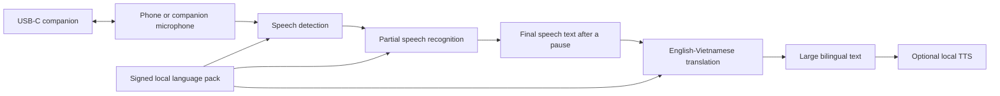
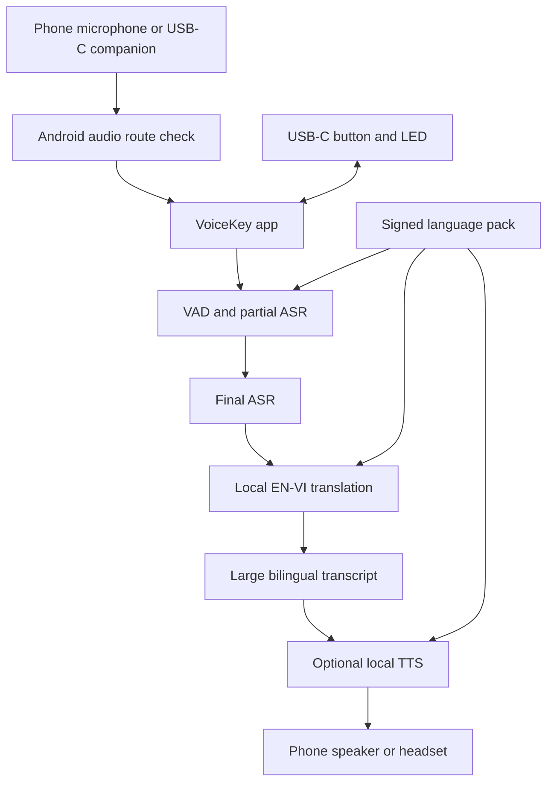

# VoiceKey

## Technical Proposal

### Offline real-time English-Vietnamese translation for short, face-to-face conversations

| Item | Details |
|---|---|
| Project | VoiceKey |
| Submission type | Phase 2 technical proposal |
| Version | v2.1 |
| Date | 21 August 2026 |
| First platform | Android |
| Submission status | Technical concept and validation plan. Add team names, measured results, and a VoiceKey demo before final filing. |

## 1. Executive Summary

VoiceKey is a proposed offline English-Vietnamese translation system for short, face-to-face conversations. It helps Vietnamese frontline workers communicate with English-speaking trainers, supervisors, technicians, or visitors without waiting for an interpreter or relying on stable internet access. The first use case is a two-person conversation in an indoor setting such as onboarding, maintenance, warehouse work, or field service. VoiceKey is a communication aid, not a safety system. Critical instructions still need local procedures and human read-back.

The first prototype is an Android app. It runs speech recognition, translation, and optional text-to-speech (TTS) locally on the phone. It shows partial text while someone speaks and a large bilingual result after a natural pause. Conversation is automatic and turn-based. VoiceKey v1 does not interpret two people speaking at the same time.

The team will also test a small USB-C companion with two close microphones, an optional button, and a recording LED. The phone provides the screen, battery, storage, speaker, and AI compute. A USB drive that only stores models does not improve translation speed or conversation quality by itself. The companion stays only if it improves audio capture, turn control, or user trust over the phone-only baseline. A full AI compute module is a later research track that needs its own processor, memory, power, and thermal design.

The central question is simple: can VoiceKey provide useful offline English-Vietnamese translation on Android? It compares phone-only and companion-assisted use under the same conditions, then keeps the hardware only if the measurements support it.

### 1.1 Problem Overview

Short spoken instructions are difficult when people do not share a language. A generic app can help, but it may depend on network access, phone-specific microphone behavior, and awkward hand-held interaction. The problem becomes more serious when people need to confirm a number, a task, a part, or a sequence quickly.

### 1.2 Proposed Solution

VoiceKey is an Android-first, offline, turn-based English-Vietnamese translation app. An optional USB-C companion can add close microphones, a visible recording state, and a physical control; the Android phone runs the local models and shows the bilingual text.

### 1.3 Key Value Proposition

1. **Offline runtime.** After a signed language pack is installed, speech recognition, translation, and optional TTS must run with the network disabled.
2. **A shared bilingual screen.** Both people see the source text and translation before acting.
3. **Automatic, turn-based conversation.** Partial text appears during speech; final translation appears after a natural pause. A button remains an optional fallback in noisy settings.
4. **A hardware decision based on evidence.** The USB-C companion remains in scope only if it improves the same conversation task over phone-only use.

---

## 2. Problem Definition and Target Users

### 2.1 Problem Statement

The first target situation is a short face-to-face conversation between a Vietnamese worker and an English-speaking colleague. The user needs quick bilingual text, not a long meeting transcript or a general business assistant. They may be in a noisy indoor setting, may not have reliable internet, and may need to check names, numbers, instructions, or technical terms. Existing translator products show useful interaction patterns, but VoiceKey still has to prove that it helps in this setting.

### 2.2 Impact Analysis

| Impact area | Current difficulty | Potential consequence | VoiceKey response to test |
|---|---|---|---|
| Understanding | Spoken instructions can be missed or misheard | Repetition and unclear confirmation | Show source and translated text together; ask for a repeat when uncertain |
| Productivity | People stop to type, call a bilingual colleague, or repeat a phrase | Slower training and task handoff | Short spoken turns and large shared text |
| Connectivity | Wi-Fi or mobile service can be weak, costly, or prohibited | Cloud-dependent translation may stop | Local runtime after pack installation |
| Privacy | Audio or text can be sent to an external service without a clear policy | Lower user trust and policy concern | No silent cloud fallback; local history is opt-in |
| Accessibility | A spoken output alone is hard to verify | One person may not know what the system heard | Visible bilingual transcript and optional spoken playback |

### 2.3 Target Users and Use Cases

| User segment | Language need | Primary context | First use case | Priority |
|---|---|---|---|---|
| Vietnamese frontline worker | Vietnamese <-> English | Factory, warehouse, field service | Receive and confirm a short instruction | High |
| English-speaking trainer or supervisor | English <-> Vietnamese | Onboarding, quality check, maintenance | Explain a process and confirm understanding | High |
| Field technician or contractor | English <-> Vietnamese | Installation, inspection, visitor support | Clarify a fault, part, measurement, or appointment | Medium |
| Operations facilitator | English <-> Vietnamese | Guided two-person discussion | Review a bilingual transcript with consent | Medium |

### 2.4 Key Design Constraints

| Constraint | Prototype target or rule |
|---|---|
| Internet dependency | No required network connection at runtime after the signed pack is installed and verified |
| Conversation mode | Automatic turn detection; partial text during speech; final translation after a pause |
| Latency | P50 <= 2.0 seconds and P95 <= 3.5 seconds from speech endpoint to final translated text for a 2 to 6 second turn |
| First language pair | English <-> Vietnamese text, speech recognition, and optional local TTS |
| Environment | Indoor pilot; test 70 to 85 dBA noise. Outdoor and very loud use are out of scope for v1. |
| Safety boundary | Never present translation as an instruction to act without normal local confirmation procedures |
| Privacy boundary | Audio is not retained by default. Conversation history is opt-in, encrypted on the phone, and deletable. |
| Platforms | Android first. Evaluate iOS as phone-only; do not promise a custom USB-C iPhone path. |

---

## 3. Business Solution and Innovation

### 3.1 Industry Problem and Solution Fit

VoiceKey focuses on short, face-to-face conversations where visible bilingual text, offline behavior, and clear device state matter more than broad language coverage or travel features.

| Existing approach | Useful feature | Trade-off for the VoiceKey use case | VoiceKey design response |
|---|---|---|---|
| Phone-only translator app | Low cost, familiar screen | Microphone position and interaction vary by phone; no physical recording state | Establish the phone-only baseline, then test whether the companion helps |
| Translation earbuds | Wearable conversation format | Bluetooth pairing, battery, and phone-app interaction add steps; text can be secondary | Use a wired companion only if it improves capture and keep the phone transcript primary |
| Standalone translator | Dedicated device and screen | Adds another battery, display, radio, charging path, and compute platform | Reuse the phone screen and local compute in v1 |
| Cloud translation service | Can use large remote models | Needs a network and moves conversation data beyond the phone | Require a local offline pipeline after pack installation |

The [Timekettle W4 Pro tutorial](https://www.youtube.com/watch?v=llJjfzfHR7c) shows a phone-coupled earbud workflow, while [Pocketalk's getting-started tutorial](https://www.youtube.com/watch?v=ah0RdIh-GjM) shows a dedicated handheld workflow. These videos demonstrate workflows, not whether VoiceKey performs better. VoiceKey instead tests phone-visible bilingual text and an offline Android runtime. Direct demos are listed in Appendix B.

### 3.2 Innovation and Competitive Strengths

| Dimension | VoiceKey v1 decision | What must still be proven |
|---|---|---|
| Offline operation | Local language pack and no silent cloud fallback | Airplane Mode test, network-egress check, and pack recovery behavior |
| Real-time interaction | Partial text while speaking; final translation after a pause | Endpointing, response time, and user acceptance |
| Shared understanding | Large bilingual transcript keeps both source and translation visible | Users can read it quickly in the target environment |
| Audio and control | Optional close microphones, button, and LED | Measurable benefit over phone microphone and touch-only control |
| Privacy | Local processing, no audio saved by default | Secure pack handling, history controls, and pilot consent flow |
| Hardware scope | No screen, battery, modem, or AI computer in v1 | USB power, reconnect, heat, and route stability on supported phones |

The USB companion is not assumed to improve translation on its own. The phone handles AI and the user interface; the companion is tested only for tasks hardware can improve. This avoids paying for a second computer before it proves its value.

### 3.3 Cost Structure and Pilot Boundary

VoiceKey has two cost layers. The companion is a low-power audio accessory. The app, offline model integration, testing, and support are the larger early investment. Public component prices and labor data are for planning only, not supplier quotes or selling prices.

| Cost layer | Planning band | What it covers |
|---|---:|---|
| EVT companion, 10 units | USD 45 to 70 per unit | Board, simple enclosure or pigtail, basic assembly, and test |
| Pilot companion, 30 to 40 units | USD 38 to 60 per unit | Lower assembly cost, with spares and rework still material |
| 100-unit preproduction companion | USD 30 to 45 per unit | Better component and assembly pricing; still not a production quote |
| 10-user BYOD pilot | USD 2.835k to 9.210k direct cash | Dongles, simple fixture, packaging, field support, and replacement reserve; excludes NRE |
| 30-user BYOD pilot | USD 5.582k to 17.640k direct cash | Same categories at the larger pilot size; excludes NRE |
| Lean MVP engineering | USD 65k to 95k | Hardware, Android, local inference, QA, pilot preparation, and pre-scan advisory |
| More complete first-release engineering | USD 95k to 145k | Full workstream planning band; formal certification remains quote-required |

The pilot should measure repeated explanations, time until both people confirm understanding, support requests, and user acceptance. Do not estimate return on investment until those values are measured. Before procurement, the team needs a selected schematic, two comparable manufacturing quotes, a warranty and replacement plan, and a clear policy for customer-provided versus loaner phones. Section 5.3 gives component and cost anchors. The [cost model](research/hardware-software-cost-model.md) lists direct pilot cash: dongles, fixtures, labels or shipping, replacement reserve, and field support. It excludes NRE, loaner phones, formal certification, and lab capital unless a row explicitly says otherwise.

### 3.4 Commercial Model

Start with a small business pilot, not a mass-market travel gadget. The pilot kit includes the companion only if it passes the baseline comparison, plus the Android app, an English-Vietnamese pack, setup guidance, and a test report. A later commercial offer could separate hardware, site onboarding, and an optional support service for signed pack updates and glossary governance. The offline translation core should not depend on a recurring cloud-inference fee.

This proposal does not set a retail price. Comparator retail prices are for context only because they bundle different phones, connectivity, warranty, language packs, support, tax, and distribution terms. The base case assumes a customer-provided Android phone from a supported-device list.

---

## 4. AI Approach and Technical Design

### 4.1 System Pipeline Overview

VoiceKey uses a cascade so each stage can be inspected and replaced independently. This is a sensible starting point for English-Vietnamese: the [PhoST benchmark](https://arxiv.org/abs/2208.04243) reports an English-Vietnamese cascade result that outperformed its end-to-end comparison. This supports the architecture choice, not VoiceKey performance.

Normal use does not require Push-to-Talk. The system detects speech and the end of a turn. The button is an optional mute or fallback control in noise. When the phone plays optional text-to-speech, live capture pauses in v1 so the speaker output is not recognized as a new user turn. Full-duplex translation, overlap handling, and acoustic echo cancellation are outside the first prototype.

### 4.2 Module-by-Module Design

The following are engineering budgets and candidate classes, not measured VoiceKey results. They do not select a final model or voice.

| Module | Candidate class | Size budget | Latency budget | Purpose and selection rule |
|---|---|---:|---:|---|
| Speech detection | Local VAD, such as [Silero VAD](https://github.com/snakers4/silero-vad) | About 2 MB class | <20 ms per chunk target | Detect start and end of a turn; verify behavior in noisy slices |
| Speech recognition | Benchmark Whisper base and small variants through [whisper.cpp](https://github.com/ggml-org/whisper.cpp), then compare them with [PhoWhisper](https://arxiv.org/abs/2406.02555) variants on named Vietnamese ASR test sets | Measured per candidate | Partial update <=500 ms after a one-second audio window; final text <=1.0 s after endpoint | Record actual quantized file size, runtime memory, accuracy, heat, and latency. Do not assume one shared size band. |
| Translation | [OPUS-MT EN-VI](https://huggingface.co/Helsinki-NLP/opus-mt-en-vi) and [OPUS-MT VI-EN](https://huggingface.co/Helsinki-NLP/opus-mt-vi-en) evaluation candidates, with release-license review | 80 to 350 MB budget | <=1.5 s target after final text | Compare bilingual adequacy, protected terms, and device performance before choosing a shipping candidate |
| Text-to-speech | Local runtime such as [sherpa-onnx](https://k2-fsa.github.io/sherpa/onnx/) with a separately reviewed voice | 30 to 120 MB budget | <=0.7 s target before playback | Optional output only; do not ship a voice until license and quality review pass |
| Glossary and confidence rules | Local approved terms, number checks, and uncertainty flags | Small | Immediate | Protect names, part codes, numbers, and site terms |

The [Whisper model card](https://github.com/openai/whisper/blob/main/model-card.md) says the released models are not real-time out of the box. Treat every model, quantization level, runtime, phone, and language pack as a separate benchmark candidate. [PhoMT](https://aclanthology.org/2021.emnlp-main.369/) and PhoWhisper guide Vietnamese evaluation; they do not grant automatic commercial rights to model weights, voices, or runtimes.

### 4.3 On-Device Optimization and Memory Management

v1 keeps one pipeline in memory at a time. It streams short audio chunks, keeps partial text small, loads only the selected English-Vietnamese pack, and releases TTS resources when they are not needed. The initial engineering target is 1.5 GB of peak AI memory on the reference phone. Record pack size, startup time, temperature, and battery use for every candidate stack.

Start with a float baseline, then test INT8 candidates where the mobile runtime supports them. Test a weight-only, low-bit variant only if it reduces memory use or heat without a meaningful quality loss. A quantized candidate can enter the pilot only if bilingual adequacy is no more than two percentage points below its float baseline, it passes the 30-minute thermal test, and it meets the response-time target. These are prototype gates, not results.

Start with a CPU implementation. Add GPU or vendor acceleration only if the same model, pack, and phone pass accuracy, latency, heat, and stability tests. The USB companion has no direct access to the phone NPU, so it is not a shortcut to hardware acceleration.

### 4.4 Robustness and Edge Cases

| Situation | Required behavior |
|---|---|
| Background noise | Show the original text, flag low confidence, and ask for a repeat rather than inventing a translation |
| Names, numbers, and part codes | Preserve protected terms and highlight uncertain segments |
| Fast speech | Ask the speaker to shorten or repeat the turn |
| Mixed English and Vietnamese | Preserve source text and request a clearer turn if the language route is unclear |
| TTS playback | Pause capture during playback in v1 to prevent echo loops |
| Missing or invalid pack | Show a clear local error. Do not use a hidden cloud fallback. |
| USB companion missing | Continue with the phone microphone and tell the user which input is active |
| Heat, power, or memory limit | Stop optional features with a visible status. Never create a result from incomplete processing. |

### 4.5 Evaluation Plan

The test set combines public research data with consented short conversations from the intended setting. It covers quiet speech, 70 to 85 dBA noise, Northern, Central, and Southern Vietnamese accents, names, numbers, technical terms, and code-switching. Report speech accuracy, bilingual review of translation adequacy, P50/P95 response time, task completion, and failure rate. Use public slices such as PhoMT as one part of the evaluation. Do not publish an accuracy claim until the target-context test passes.

| Prototype acceptance target | Pass condition before pilot |
|---|---|
| End-to-end response time | P50 <=2.0 seconds and P95 <=3.5 seconds from endpoint to final translated text on the reference phone |
| Protected terms and numbers | At least 90 percent correct on the held-out target-context set; each critical error is reviewed separately |
| Bilingual translation adequacy | At least 80 percent of final turns rated adequate or better by bilingual reviewers using a fixed rubric |
| Short-task completion | At least 80 percent of scripted tasks completed after normal human confirmation |
| Offline and stability | All required turns pass in Airplane Mode and in a network-enabled test that records zero VoiceKey outbound connections after the local pack is installed and verified. For the 30-minute session, report the pack version and hash, capture method, crashes, and route losses. |

---

## 5. Hardware and Device Concept

### 5.1 Platform Selection and Justification

v1 puts the local AI on the phone and uses an optional low-power USB audio companion. It lets the team test the translation experience without assuming that a small USB peripheral can contain a full AI computer.

| Criterion | Phone-only baseline | USB audio and interaction companion | VoiceKey Edge compute module | v1 decision |
|---|---|---|---|---|
| AI compute | Phone CPU, GPU, and supported mobile runtime | Still runs on phone | Own processor, AI accelerator, RAM, storage, and firmware | Phone hosts AI |
| Audio interaction | Built-in phone microphone and touchscreen | Close microphones, optional button, LED | Could add audio control but needs a complete device design | Compare companion against phone |
| Power and heat | Phone-only load must be measured | Low-power accessory target, <350 mW average | Multi-watt compute plus controlled power and thermal design | Do not build compute module in v1 |
| Display and speaker | Phone screen and speaker | Same phone UI | Needs its own user interface or phone companion | Reuse phone |
| Hardware cost and certification | Lowest | Moderate, without battery or radio | Highest: SoM, memory, battery or external power, thermal design, enclosure | Companion only if it passes test |
| Product risk | Little physical differentiation | USB compatibility and audio route must be proven | Large hardware, supplier, thermal, and iOS risk | Android first |

Two current embedded platforms illustrate the future Edge hardware class. Qualcomm documents the [QCS6490](https://www.qualcomm.com/internet-of-things/products/q6-series/qcs6490) with up to 12 dense TOPS and up to 16 GB LPDDR5. MediaTek documents the [Genio 1200](https://www.mediatek.com/products/iot/genio-iot/genio-1200) with 4.8 TOPS and support for up to 16 GB LP4X. These are examples, not selected parts or VoiceKey performance claims. A future Edge module proceeds only if it is faster or more consistent than the phone baseline and passes a 30-minute controlled power and heat test.

| Compute platform | Published compute or memory context | Power and thermal boundary | VoiceKey role | Status |
|---|---|---|---|---|
| [Google Pixel 8](https://support.google.com/pixelphone/answer/7158570?hl=en), Tensor G3, 8 GB RAM | Phone CPU, GPU, and supported Android runtime; no direct USB-to-NPU claim | Reuse phone battery and measure the full translation load | Reference Android compute platform for v1 | Selected for benchmark |
| Qualcomm QCS6490 | Up to 12 dense TOPS and up to 16 GB LPDDR5 | Requires its own controlled power, RAM, board, and thermal design | Future Edge compute candidate | Research only |
| MediaTek Genio 1200 | 4.8 TOPS and up to 16 GB LP4X | Requires its own controlled power, RAM, board, and thermal design | Future Edge compute candidate | Research only |

Android is first because its documented APIs cover USB host and accessory communication, USB audio, and microphone capture. A supported-phone matrix and route verification are still required. [Android USB](https://developer.android.com/develop/connectivity/usb) [Android USB audio](https://source.android.com/docs/core/audio/usb) [Android AudioRecord](https://developer.android.com/reference/android/media/AudioRecord)

iOS starts as a phone-only app using the built-in microphone and speaker through [AVAudioSession](https://developer.apple.com/documentation/avfaudio/avaudiosession/category-swift.struct/playandrecord). Apple's [AccessoryAccess USB entitlement](https://developer.apple.com/documentation/bundleresources/entitlements/com.apple.developer.accessory-access.usb?changes=__1) is for macOS USB access, not iOS accessories. A wired iPhone companion is outside v1 until a current Apple-supported iOS framework and hardware demonstrate it.

### 5.2 Form Factor, Components, and Power Budget

The v1 companion is a prototype, not a finished industrial product. It targets less than 20 g, about 45 x 22 x 9 mm, and a short flexible USB-C pigtail to reduce strain on the phone port. It has no display, battery, cellular radio, or model storage.

| Component | Specification or class | Target active power | Role |
|---|---|---:|---|
| USB-C attachment | Pigtail, passive USB-device CC path, ESD, USB 2.0 data | Low | Stable physical connection; no power pass-through in v1 |
| MCU and audio bridge | Low-power USB-capable MCU | 20 to 80 mW class | USB Audio Class, LED/button control, signed firmware update |
| Audio front end | Stereo voice codec or ADC class | 20 to 60 mW class | Clocking, level management, and microphone interface |
| Close microphones | Two digital MEMS microphones | 10 to 40 mW class | Test whether capture improves in the target setting |
| Button and LED | Optional button and visible status LED | <20 mW class | Mute or fallback control and recording state |
| Flash, PCB, passives, ESD | Firmware/configuration and protection | Low | No user audio storage and no model inference |
| Total companion | USB audio and interaction device | <350 mW average target | Measure on every supported phone before release |

The limit is low because the phone supplies the power and AI compute. No all-day battery-life claim is made. Test three 30-minute active sessions on each reference phone: phone-only, companion attached but idle, and companion attached with active translation. Record battery-percent change, surface temperature, reconnects, actual audio route, and failures. Brownout, repeated USB enumeration, route loss, or unsafe heat fails the configuration.

### 5.3 Indicative BOM and Prototype Equipment

All figures are USD planning estimates based on public component listings. They are not supplier quotes, a final bill of materials, or a selling price.

The public anchors cover the [STM32U575 MCU](https://www.mouser.com/en/ProductDetail/STMicroelectronics/STM32U575CIT6), [TLV320AIC3263 codec](https://www.ti.com/product/TLV320AIC3263), and [SPH0655 digital microphone](https://www.digikey.com/en/products/detail/syntiant/SPH0655LM4H-1-8/11506911). The [STUSB4500](https://www.st.com/en/interfaces-and-transceivers/stusb4500.html) is an alternative sink and PD-controller reference only. It is excluded from the v1 passive USB-device CC BOM unless the selected schematic explicitly changes to a controller-based topology. Assembly, enclosure, test, and manufacturing yield still need supplier quotes.

| BOM block | Planning cost per unit | Boundary |
|---|---:|---|
| USB connection | USD 1.50 to 4.00 | One plug or pigtail, CC implementation, ESD, and connection-specific passives |
| MCU and audio bridge | USD 7.00 to 10.62 | USB enumeration, reconnect, LED/button, and signed firmware control |
| Codec or audio front end | USD 7.38 to 13.58 | Audio interface and signal-quality validation |
| Two digital MEMS microphones | USD 2.10 to 4.26 | Compare with the phone microphone in target noise slices |
| Controls and PCB | USD 3.15 to 8.60 | Button, LED, PCB, and non-USB passives |
| Enclosure, assembly, and test | USD 9.00 to 28.00 | Shell, strain relief, low-volume assembly, functional test, and rework |

The schematic must choose one Type-C configuration: a passive USB-device CC path or a named controller design. Never count both. Use the complete-unit bands in Section 3.3 for pilot planning until a configuration and two manufacturing quotes are selected.

| Equipment | Why it is needed | Planning outlay |
|---|---|---:|
| Three Android test phones | Compatibility, sustained inference, thermal, and audio-route matrix | USD 600 to 2,500 total |
| USB power meter and bench supply | Current, brownout, and phone-source measurement | USD 95 to 420 |
| Logic analyzer and oscilloscope | USB timing, reset, rail, and signal debugging | USD 210 to 2,000+ |
| Soldering and rework kit | EVT bring-up and board changes | USD 100 to 400 |
| Basic audio and thermal checks | SPL or reference device plus IR check | USD 70 to 900 |
| Prototype enclosure iteration | Fit, strain relief, and ergonomics | USD 50 to 300 per iteration |

### 5.4 Hardware Release Gates

- Every supported phone passes tests for attachment, detachment, reconnection, screen lock, app restart, microphone-permission revocation, and Airplane Mode.
- The app confirms the actual capture route while recording. Requesting an external microphone is not enough. If the companion is not active, the app shows a phone-microphone fallback.
- A 30-minute session passes without brownout, route loss, repeated enumeration, crash, or unsafe thermal behavior.
- The companion provides a meaningful measured improvement over the phone-only baseline in the target noise condition. If it does not, VoiceKey remains phone-only.

---

## 6. System Architecture and Integration

### 6.1 Software Stack

| Layer | Component | Role |
|---|---|---|
| Android OS | Android 13+ initial target | USB host, audio routing, microphone permission, display, storage, and thermal/battery signals |
| App | Kotlin and a native inference bridge | Conversation UI, language-pack setup, state machine, consent, and failure messages |
| Audio | Android audio stack and USB Audio Class companion | Phone microphone by default; companion only after actual route verification |
| Speech processing | Local VAD, ASR, translation, optional TTS | Run the selected English-Vietnamese stack offline after pack install |
| Pack management | Signed local pack registry | Version, hash, model and voice provenance, license record, and offline readiness |
| Privacy and security | Android Keystore and encrypted opt-in history | Local settings, deletion, and protection of retained history |

Android capture follows documented microphone-permission and foreground-service requirements. If either is unavailable, VoiceKey stops capture and tells the user. [Android foreground-service requirements](https://developer.android.com/about/versions/14/changes/fgs-types-required)

### 6.2 Architecture Diagram

The USB companion does not process the full AI pipeline in v1. The phone app manages the microphone state, language pack, model runtime, transcript, and all user-visible errors. This lets the team test translation without hardware and decide whether to keep the companion.

### 6.3 Offline-First Design Principles

- Each pack has a versioned manifest signed with a release key pinned in the app. Before activation, the app verifies the signature, file hashes, and revocation status. Key rotation and rollback are release tests.
- Runtime audio, speech recognition, translation, and optional TTS run without a network connection.
- A missing pack, invalid signature, unavailable microphone, or disconnected companion produces a clear local error, not a hidden cloud fallback.
- Audio is discarded after processing by default. History is an explicit user choice.
- Every pack records its version, hash, model and voice provenance, and release-license review.

---

## 7. Team Profile and Project Timeline

### 7.1 Required Team Roles

Before filing, replace these placeholders with real names, short qualifications, and contact details.

| Team member | Role | Required experience | Contribution |
|---|---|---|---|
| To be named by submitting team | Product and field lead | User research, pilot design, operational safety | Scope, pilot success measures, consent, and partner coordination |
| To be named by submitting team | Speech and translation lead | ASR, machine translation, evaluation, licensing | Model comparison, English-Vietnamese quality review, pack release ledger |
| To be named by submitting team | Android lead | Kotlin, mobile audio, local inference | Offline app, microphone/USB integration, phone matrix, privacy controls |
| To be named by submitting team | Hardware and firmware lead | USB-C, audio, PCB, embedded firmware | Companion EVT, power, LED/button, signed firmware, test fixture |
| To be named by submitting team | UX and test lead | Bilingual UX, usability test, accessibility | Transcript interface, failure states, study protocol, evidence demo |

### 7.2 Project Timeline

| Phase | Milestone | Key work | Target |
|---:|---|---|---|
| 1 | Phone-only baseline | Choose reference phone, install local EN-VI pack, record offline baseline | Weeks 1 to 2 |
| 2 | Model comparison | Compare ASR, translation, and optional TTS candidates; measure pack size, RAM, heat, and latency | Weeks 3 to 5 |
| 3 | USB companion EVT | Build microphone, LED, and button prototype; verify attach, route, reconnect, and fallback | Weeks 6 to 8 |
| 4 | Controlled demo | Run short two-person turns in Airplane Mode and in a network-enabled test that records zero VoiceKey outbound connections, with visible source text, translation, and timing | Weeks 9 to 10 |
| 5 | Small supervised pilot | Test 10 users, then expand only if quality, heat, and companion benefit pass | Weeks 11 to 14 |
| 6 | Decision report | Publish supported phones, results, failures, cost update, and Edge decision | Weeks 15 to 16 |

### 7.3 Demonstration Standard

The technical demo should be a real test, not a scripted marketing clip. Show the exact phone, Android build, app build, pack version, Airplane Mode, and actual microphone route. Also show source text, translated text, timing, one noisy turn, and one visible failure or fallback. Appendix C has a suggested shot list.

---

## 8. Submission Checklist

| # | Checklist item | Current status |
|---:|---|---|
| 1 | Executive summary, problem, users, and constraints are complete | Done |
| 2 | Business solution, comparison, price boundary, and pilot cost plan are complete | Done as a planning proposal |
| 3 | AI pipeline, candidate classes, optimization plan, robustness, and evaluation plan are complete | Done as a technical design; measurements pending |
| 4 | Hardware choice, indicative BOM, power target, and equipment needs are complete | Done as a technical design; EVT and supplier quotes pending |
| 5 | Architecture and offline-first rules are complete | Done |
| 6 | Team roster and contact details are complete | Pending user-provided names and credentials |
| 7 | Timeline is complete | Done as relative weeks; add calendar dates before filing |
| 8 | VoiceKey technical demo video is attached | Pending a real prototype recording |
| 9 | Final DOCX and PDF are exported and proofread | DOCX generated with this proposal; final PDF is pending team details and demo evidence |

---

## Appendix A. Research Sources and Claim Boundaries

| Source | What it supports | What it does not prove |
|---|---|---|
| [PhoST](https://arxiv.org/abs/2208.04243) | English-Vietnamese speech translation benchmark and a cascade result in that study | VoiceKey accuracy, latency, or user value |
| [PhoWhisper](https://arxiv.org/abs/2406.02555) | Vietnamese ASR research and evaluation context | A commercial phone deployment |
| [PhoMT](https://aclanthology.org/2021.emnlp-main.369/) | Vietnamese-English translation data and evaluation context | A shipping model license or product result |
| [Whisper model card](https://github.com/openai/whisper/blob/main/model-card.md) | Scope and runtime caveat for a baseline ASR family | Real-time behavior on a named VoiceKey phone |
| [whisper.cpp](https://github.com/ggml-org/whisper.cpp) and [OPUS-MT EN-VI](https://huggingface.co/Helsinki-NLP/opus-mt-en-vi) / [VI-EN](https://huggingface.co/Helsinki-NLP/opus-mt-vi-en) | Named evaluation candidates and local-runtime research starting points | Shipping rights, accuracy, and latency without the VoiceKey model comparison |
| [sherpa-onnx](https://k2-fsa.github.io/sherpa/onnx/) | Local speech, VAD, Android, and TTS runtime research | Voice quality or commercial voice rights |
| [Android USB](https://developer.android.com/develop/connectivity/usb) and [AOSP USB audio](https://source.android.com/docs/core/audio/usb) | Android USB and digital-audio mechanisms | Compatibility with every phone or accessory |
| [Android AudioRecord](https://developer.android.com/reference/android/media/AudioRecord) | Microphone capture and routed-device verification research | A companion microphone being active merely because it was requested |
| [Apple AVAudioSession](https://developer.apple.com/documentation/avfaudio/avaudiosession/category-swift.struct/playandrecord) | iOS phone-only microphone and speaker path | A custom wired iPhone accessory or generic USB-C accessory route |
| [QCS6490](https://www.qualcomm.com/internet-of-things/products/q6-series/qcs6490) and [Genio 1200](https://www.mediatek.com/products/iot/genio-iot/genio-1200) | Example embedded compute classes for a future Edge module | VoiceKey Edge performance or cost |
| [NIST AI RMF](https://airc.nist.gov/airmf-resources/airmf/5-sec-core/) | Human oversight framing for any future summaries or business drafts | Automated approval of an invoice, order, or safety action |

### Core academic references

- Nguyen et al. (2022), ["A High-Quality and Large-Scale Dataset for English-Vietnamese Speech Translation"](https://arxiv.org/abs/2208.04243), INTERSPEECH 2022. Supports the 508-hour EN-VI benchmark and its cascade-versus-end-to-end result.
- Le, Nguyen, and Nguyen (2024), ["PhoWhisper: Automatic Speech Recognition for Vietnamese"](https://arxiv.org/abs/2406.02555), ICLR 2024 Tiny Papers. Supports Vietnamese ASR candidate and evaluation context.
- Doan et al. (2021), ["PhoMT: A High-Quality and Large-Scale Benchmark Dataset for Vietnamese-English Machine Translation"](https://aclanthology.org/2021.emnlp-main.369/), EMNLP 2021. Supports Vietnamese-English text-MT evaluation context.

## Appendix B. Comparable Products and Public Demos

These links show related product formats and user flows. They are not VoiceKey benchmarks. A vendor tutorial can show a workflow, but not independent accuracy, latency, offline reliability, or microphone quality.

| Platform | Product and direct link | What it is useful for | Evidence boundary |
|---|---|---|---|
| Product page | [Timekettle W4 Pro](https://www.timekettle.co/pages/w4-pro) | Phone-coupled earbud form factor and vendor pack workflow | Vendor product description only; not an EN-VI offline comparator or a benchmark |
| YouTube | [Timekettle W4 Pro official tutorial](https://www.youtube.com/watch?v=llJjfzfHR7c) | Setup and translation-mode flow | Official vendor workflow only |
| Product page and manual | [Pocketalk S2 Plus](https://pocketalk.com/product/pocketalk-s2-plus-5-year-esim-white) and [S2 setup manual](https://manual.pocketalk.com/pts2/en/01.html) | Screen-first handheld workflow and connectivity setup | Vendor documentation, not a benchmark |
| YouTube | [Pocketalk How to Translate](https://www.youtube.com/watch?v=93i6N-KHhco) | Hands-on handheld translation steps | Official vendor workflow only |
| Product page | [Vasco Translator E1](https://vasco-translator.com/translators/vasco-translator-e1) and [Vasco Translator V4](https://vasco-translator.com/translators/vasco-translator-v4) | Wearable and handheld product formats | Vendor product descriptions, not a benchmark |
| YouTube | [Vasco Translator E1 official demo](https://www.youtube.com/watch?v=C92rY4D9dAk) | Wearable conversation framing | Official vendor workflow only |
| Facebook | [Timekettle W4 Pro vendor video](https://www.facebook.com/timekettleglobal/videos/welcome-to-the-official-w4-pro-ai-interpreter-earbuds-tutorial-in-this-video-wel/501790599342399/) | Secondary social workflow example | May be region or login restricted; vendor marketing only |
| Douyin | [Timekettle W3 versus M3 official-store video](https://www.douyin.com/shipin/7277811363270084644) | Vendor-described interaction difference: W3 hands-free speaking versus M3 button-triggered turns | Social store content; no accuracy, latency, or offline claim |

## Appendix C. VoiceKey Evidence Demo Shot List

| Time | Shot | What it proves |
|---:|---|---|
| 0 to 10 seconds | Show the exact Android phone, app build, EN-VI pack version, and Airplane Mode. Include the recorded result of the network-enabled test that records zero VoiceKey outbound connections. | Test setup and offline precondition |
| 10 to 20 seconds | Show the phone microphone route, then attach the companion and show the actual route change and LED state | The input route is verified, not assumed |
| 20 to 40 seconds | English turn followed by Vietnamese turn; show partial text, final bilingual text, and an endpoint-to-result timer | Turn-based real-time flow under stated conditions |
| 40 to 50 seconds | Play optional TTS and show that capture is paused | Echo-loop control in v1 |
| 50 to 65 seconds | Run one noisy turn and one missing-pack or disconnected-companion case | Honest failure and fallback behavior |
| 65 to 80 seconds | Show device list, P50/P95 results, 30-minute session summary, and any failure count | Reproducibility boundary |

## Appendix D. Scope Limits and Release Conditions

- Do not describe turn-based translation as simultaneous, full-duplex interpretation until overlap, echo, heat, and latency tests pass.
- Do not claim a measured result, project demo, supplier quote, IP rating, certification, or commercial release before it exists.
- Do not claim a custom USB-C iPhone path. Validate phone-only iOS first.
- Do not ship a model or voice without a release ledger for weights, runtime, tokenizer, data obligations, and redistribution rights.
- Do not set a VoiceKey price from a raw BOM or a competitor retail page. Use selected hardware, two manufacturing quotes, warranty assumptions, and observed pilot support cost.
- Do not keep the USB companion because it is novel. Keep it only if the phone-only comparison shows a meaningful benefit.
